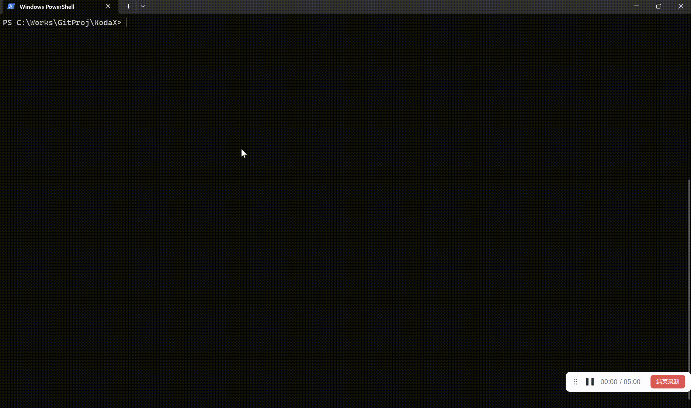

<p align="center">
  <picture>
    <source media="(prefers-color-scheme: dark)" srcset="assets/logo-dark.svg">
    <source media="(prefers-color-scheme: light)" srcset="assets/logo-light.svg">
    
  </picture>
</p>

<p align="center">
  <b>Open-source AI coding agent on every LLM you can reach.</b><br>
  Anthropic · OpenAI · DeepSeek · Kimi · Zhipu · MiniMax · MiMo · Ark · Qwen · Gemini · Codex.<br>
  REPL · CLI · library · Node-free single binary.
</p>

<p align="center">
  <a href="https://www.npmjs.com/package/@kodax-ai/kodax"></a>
  <a href="LICENSE"></a>
  <a href="https://github.com/icetomoyo/KodaX/stargazers"></a>
  <a href="https://github.com/icetomoyo/KodaX/actions"></a>
  
</p>

<p align="center">
  <a href="#install-in-30-seconds">Install</a> ·
  <a href="#four-ways-to-use-kodax">Usage</a> ·
  <a href="#sdk-usage">SDK</a> ·
  <a href="CHANGELOG.md">Changelog</a> ·
  <a href="docs/FEATURE_LIST.md">Roadmap</a> ·
  <a href="https://github.com/icetomoyo/KodaX/discussions">Discussions</a> ·
  <a href="README_CN.md">中文 README</a>
</p>

<p align="center">
  
</p>

---

## Install in 30 seconds

```bash
npm i -g @kodax-ai/kodax

# Pick any one you have an API key for:
export ZHIPU_API_KEY=...        # or ANTHROPIC_API_KEY / OPENAI_API_KEY / KIMI_API_KEY /
                                # MINIMAX_API_KEY / MIMO_API_KEY / ARK_API_KEY / QWEN_API_KEY /
                                # DEEPSEEK_API_KEY / GEMINI_API_KEY

kodax
```

That's it. You're in the REPL — ask anything in natural language.

> **No-Node target machines:** download a Bun-compiled single binary for Windows / macOS / Linux × x64 + arm64 from the [GitHub Releases](https://github.com/icetomoyo/KodaX/releases) page. See [docs/release.md](docs/release.md) for the build pipeline.

---

## Four ways to use KodaX

| Form | Command / Import | When to use it |
|---|---|---|
| **REPL** | `kodax` | Interactive multi-turn coding session with streaming UI, permissions, slash commands |
| **CLI** | `kodax -p "your task"` | One-shot scripted task, CI runs, batch processing |
| **Library** | `import { runKodaX } from '@kodax-ai/kodax'` | Embed in your own tool / agent / web service |
| **Single binary** | `./kodax` | Distribute to machines that don't have Node installed |

---

## Why KodaX

<table>
  <tr>
    <td width="33%" align="center" valign="top">
      <h3>🇨🇳 6 China-native LLMs</h3>
      <sub>Zhipu · Kimi · MiniMax · MiMo · Ark · Qwen</sub>
      <br><br>
      First-class adapters with cross-provider <a href="benchmark/EVAL_GUIDELINES.md">prompt-eval calibration</a> on a canonical 5-alias panel — not OpenAI-compat shims.
    </td>
    <td width="33%" align="center" valign="top">
      <h3>📦 Single-file binary</h3>
      <sub>Bun --compile · Win / macOS / Linux · x64 + arm64</sub>
      <br><br>
      No Node required on the target machine. Drop one file, run anywhere — restricted envs, CI runners, air-gapped boxes.
    </td>
    <td width="33%" align="center" valign="top">
      <h3>🌳 Branchable session lineage</h3>
      <sub>Fork · rewind · parallel edit</sub>
      <br><br>
      Conversation history is a DAG, not a list. Powers the upcoming <b>KodaX Space</b> desktop app.
    </td>
  </tr>
  <tr>
    <td align="center" valign="top">
      <h3>🤖 Multi-agent by default</h3>
      <sub>V2 Worker + Evaluator + async children</sub>
      <br><br>
      <code>dispatch_child_task</code>, <code>send_message</code>, <code>task_stop</code>, multi-instance auto-coordination with content-hash safety net.
    </td>
    <td align="center" valign="top">
      <h3>🧩 Skills + self-construction</h3>
      <sub>Markdown skills, NL triggers</sub>
      <br><br>
      5-stage self-modification staircase (scaffold → validate → stage → test → activate) gated by an 8-invariant admission contract.
    </td>
    <td align="center" valign="top">
      <h3>🛠 30+ built-in tools</h3>
      <sub>File · shell · search · MCP · ACP</sub>
      <br><br>
      Repo intelligence, semantic search, git worktree, web fetch — all addressable through one clean tool surface.
    </td>
  </tr>
</table>

## How KodaX compares

| Feature | **KodaX** | Claude Code | Aider | Codex CLI | Cursor | Cline |
|---|---|---|---|---|---|---|
| Open source | ✅ Apache&nbsp;2.0 | ❌ Source-available | ✅ Apache&nbsp;2.0 | ✅ Apache&nbsp;2.0 | ❌ Proprietary | ✅ Apache&nbsp;2.0 |
| Node-free single binary | ✅ Bun | ❌ Node | ❌ Python | ✅ Rust | ❌ Electron | ❌ Extension |
| Native China providers<br><sub>(Zhipu · Kimi · MiniMax · MiMo · Ark · Qwen)</sub> | ✅ 6 native | ❌ | ⚠ via LiteLLM | ❌ OpenAI-first | ❌ no provider menu | ⚠ Kimi / Qwen / DeepSeek |
| Branchable session lineage | ✅ fork & rewind | ⚠ routines / sessions | ❌ | ❌ | ❌ | ⚠ checkpoints |
| Multi-agent + MCP + 30+ tools | ✅ all three | ✅ all three | ⚠ tools, no MCP | ✅ all three | ⚠ Composer + MCP | ✅ all three |

<sub>Data verified May 2026 against public docs ([Claude Code](https://github.com/anthropics/claude-code) · [Aider](https://aider.chat/docs/llms.html) · [Codex CLI](https://github.com/openai/codex) · [Cursor](https://cursor.com) · [Cline](https://github.com/cline/cline)). ⚠ = partial / requires extra setup / not first-class. Corrections welcome via PR.</sub>

## Detailed Setup

> The `npm i -g @kodax-ai/kodax` one-liner above is the fastest path. This section is for building from source, configuring custom providers, or using KodaX as a library.

### 1. Build the CLI from source

```bash
git clone https://github.com/icetomoyo/KodaX.git
cd KodaX
npm install
npm run build
npm link
```

### 2. Configure a provider

KodaX reads API keys from environment variables. For built-in providers, the fastest path is:

```bash
# macOS / Linux
export ZHIPU_API_KEY=your_api_key

# PowerShell
$env:ZHIPU_API_KEY="your_api_key"
```

For CLI defaults, create `~/.kodax/config.json`:

```json
{
  "provider": "zhipu-coding",
  "reasoningMode": "auto"
}
```

If you need a custom base URL or an OpenAI/Anthropic-compatible endpoint, define a custom provider in the same config file:

```json
{
  "provider": "my-openai-compatible",
  "customProviders": [
    {
      "name": "my-openai-compatible",
      "protocol": "openai",
      "baseUrl": "https://example.com/v1",
      "apiKeyEnv": "MY_LLM_API_KEY",
      "model": "my-model",
      "userAgentMode": "compat"
    }
  ]
}
```

`userAgentMode` defaults to `"compat"`, which sends `KodaX` instead of the official SDK User-Agent. Switch it to `"sdk"` only when your gateway expects the upstream SDK header.

#### Opting a custom provider into image / vision input (FEATURE_134 v0.7.40)

If your custom provider's underlying model supports image input (vision), add a `capabilityProfile.multimodalSupport: "image-input"` block so KodaX does not artificially block multimodal requests at the SA-path policy gate. The 12 built-in vision-capable providers (Anthropic, OpenAI, the 9 Anthropic-/OpenAI-compat clones — DeepSeek, Kimi, Kimi-code, Qwen, Zhipu, Zhipu-coding, MiniMax-coding, MiMo-coding, Ark-coding — plus Gemini-CLI via the CLI's `@<path>` file-include syntax) already ship with this flag enabled by default; only Codex-CLI and custom providers need to opt in.

```json
{
  "customProviders": [
    {
      "name": "my-vision-provider",
      "protocol": "openai",
      "baseUrl": "https://example.com/v1",
      "apiKeyEnv": "MY_LLM_API_KEY",
      "model": "my-vision-model",
      "capabilityProfile": {
        "transport": "native-api",
        "conversationSemantics": "full-history",
        "mcpSupport": "none",
        "contextFidelity": "full",
        "toolCallingFidelity": "full",
        "sessionSupport": "full",
        "longRunningSupport": "full",
        "multimodalSupport": "image-input",
        "evidenceSupport": "full"
      }
    }
  ]
}
```

The serializer layer (`packages/llm/src/providers/anthropic.ts:770` for Anthropic-compat, `openai.ts:904` for OpenAI-compat) forwards image blocks automatically through base-class inheritance. The flag only gates whether KodaX's policy layer pre-rejects multimodal requests — the model-level vision contract remains your upstream provider's responsibility. If the model is actually text-only, you'll see the real upstream API error instead of a KodaX-side rejection.

### 3. Start in REPL or run a one-shot task

```bash
# Interactive REPL
kodax

# Then ask naturally inside the REPL
Read package.json and summarize the architecture
/mode
/help

# One-shot CLI usage
kodax "Review this repository and summarize the architecture"
kodax --session review "Find the riskiest parts of src/"
kodax --session review "Give me concrete fix suggestions"
```

### 4. Use it as a library

Library usage still expects API keys from environment variables. If you want custom provider names or base URLs in code, register them explicitly:

```typescript
import { registerCustomProviders, runKodaX } from '@kodax-ai/kodax';

registerCustomProviders([
  {
    name: 'my-openai-compatible',
    protocol: 'openai',
    baseUrl: 'https://example.com/v1',
    apiKeyEnv: 'MY_LLM_API_KEY',
    model: 'my-model',
    userAgentMode: 'compat',
  },
]);

const result = await runKodaX(
  {
    provider: 'my-openai-compatible',
    reasoningMode: 'auto',
  },
  'Explain this codebase'
);
```

> **Embedding KodaX inside another app?** (KodaX Space, IDE extensions, custom CLIs)
> See [docs/SDK_EMBEDDER_GUIDE.md](docs/SDK_EMBEDDER_GUIDE.md) for the runtime-mutation
> surface (`startKodaX` + `RunningSession`), MCP popout manager API (`McpManager`),
> Skill `` !`cmd` `` host hook, and per-app data dir namespacing (`getAppDataDir`).

## Repo Intelligence (optional premium engine)

KodaX ships with built-in OSS repo intelligence (`repo_overview`, `module_context`, `symbol_context`, `process_context`, `impact_estimate`, …) that helps the coding agent understand large codebases without ad-hoc grep/glob exploration.

An optional **premium engine** (`repointel` local daemon, distributed via the sibling `KodaX-private` repo) adds proactive context injection, deeper module capsules, and a native auto-lane integration. KodaX automatically falls back to OSS when premium is unavailable.

```bash
# Pick a runtime mode (off | oss | premium-shared | premium-native | auto)
kodax --repo-intelligence premium-native --repo-intelligence-trace
```

Setup, runtime modes, REPL controls, config schema, and external-host integrations: see [docs/REPOINTEL.md](docs/REPOINTEL.md).

## Architecture

KodaX uses a **monorepo architecture** with npm workspaces. Source layout has 9 workspace packages; published as a single bundled npm package `@kodax-ai/kodax` with 6 SDK subpath exports (`/agent`, `/llm`, `/coding`, `/repl`, `/skills`, `/mcp`; ADR-022 + ADR-024 v0.7.39 + ADR-032 v0.7.42 added `/mcp`):

```
KodaX/
├── packages/                # 4 workspace packages (FEATURE_194 v0.7.43)
│   ├── llm/                 # @kodax-ai/llm - LLM abstraction (12 providers)
│   │   └── providers/       # Anthropic, OpenAI, DeepSeek, Kimi, MiMo, MiniMax, Zhipu, Ark, …
│   │
│   ├── agent/               # @kodax-ai/agent - Generic Agent framework
│   │   ├── orchestration/   # Runner, runFanOut, runWithIdleYield, ChildTaskRegistry
│   │   ├── session-lineage/ # branchable session tree (inline v0.7.43)
│   │   ├── capabilities/
│   │   │   ├── mcp/         # MCP integration (inline v0.7.43)
│   │   │   └── skills/      # Skills standard implementation + builtin (inline v0.7.43)
│   │   └── tracing/         # tracing / observability (inline v0.7.43)
│   │
│   ├── coding/              # @kodax-ai/coding - Coding Agent (tools + prompts)
│   │   ├── tools/           # 30+ tools: read, write, edit, bash, glob, grep, undo,
│   │   │                    #   dispatch_child_task, send_message, task_stop,
│   │   │                    #   ask_user_question, repo-intelligence, …
│   │   └── repo-intelligence/ # incl. protocol.ts (inline v0.7.43)
│   │
│   └── repl/                # @kodax-ai/repl - Interactive terminal UI (Ink TUI)
│
├── src/                     # CLI entry + SDK subpath entries
│   ├── kodax_cli.ts         # Main CLI entry point (bin: `kodax`)
│   └── sdk-*.ts             # SDK subpath re-exports → @kodax-ai/kodax/{agent,llm,coding,repl}
│
└── package.json             # Root workspace config; release.mjs rewrites name + injects subpath exports
```

### Package Dependencies

```
                    ┌──────────────────┐
                    │  kodax (root)    │
                    │  CLI Entry       │
                    └────────┬─────────┘
                             │
              ┌──────────────┴──────────────┐
              │                             │
              ▼                             ▼
       ┌──────────────┐              ┌────────────────┐
       │@kodax-ai/repl│              │@kodax-ai/coding│
       │  UI Layer    │              │ Tools+Prompts  │
       └──────┬───────┘              └──────┬─────────┘
              │                             │
              │              ┌──────────────┴──────────────┐
              │              │                             │
              ▼              ▼                             ▼
       ┌──────────────┐ ┌──────────────────────────┐ ┌──────────────┐
       │@kodax-ai/    │ │@kodax-ai/agent           │ │@kodax-ai/llm │
       │coding (via   │ │Runner + fan-out +        │ │LLM Abstract  │
       │above)        │ │idle-yield + session-     │ │(12 providers)│
       │              │ │lineage + skills + mcp +  │ │              │
       │              │ │tracing (FEATURE_194)     │ │              │
       └──────────────┘ └──────────────────────────┘ └──────────────┘
```

### Package Overview

Source-side workspace package names (`@kodax-ai/*`). npm consumers install the single bundled `@kodax-ai/kodax` package and import from SDK subpaths — see [Source-side vs npm-published surface](#source-side-vs-npm-published-surface) and [SDK Usage](#sdk-usage) below.

| Workspace package | Purpose | Key Dependencies |
|---------|---------|------------------|
| `@kodax-ai/llm` | LLM abstraction (12 providers + custom registration) | @anthropic-ai/sdk, openai |
| `@kodax-ai/agent` | Generic Agent framework — Runner, fan-out, idle-yield, session-lineage, capabilities (mcp + skills), tracing (ADR-036 v0.7.43 consolidation; subpaths: `/session-lineage`, `/capabilities/mcp`, `/capabilities/skills`, `/tracing`) | @kodax-ai/llm, js-tiktoken, fflate, yaml |
| `@kodax-ai/coding` | Coding Agent — 30+ tools (incl. `dispatch_child_task` / `send_message` / `task_stop`) + role prompts + auto-continue + repo-intelligence protocol | @kodax-ai/llm, @kodax-ai/agent |
| `@kodax-ai/repl` | Complete interactive terminal UI (Ink/React, permission modes, commands, streaming) | @kodax-ai/coding, ink, react |

### Source-side vs npm-published surface

KodaX has two layers that consumers should understand separately:

- **Source-side**: 4 workspace packages above (what developers see when reading the repo).
- **npm-published**: a single bundled package `@kodax-ai/kodax` with 7 SDK subpaths (what SDK consumers `import` from). The subpaths are split into two roles:
  - **Full-package subpaths** (`/agent`, `/llm`, `/coding`, `/repl`) — each one maps 1:1 to a source workspace and exposes its complete public API.
  - **Narrow-subset subpaths** (`/skills`, `/mcp`, `/session`) — each one exposes only a focused capability slice carved out of `/agent` or `/repl`. This lets consumers who only need (say) the Skills system import a much smaller surface without pulling in the full agent framework.

| Source package | npm subpath | Type | What you get | Example consumer |
|---|---|---|---|---|
| `packages/llm`    | `@kodax-ai/kodax/llm`     | Full package | 12-provider LLM abstraction (77 exports) | Standalone LLM clients |
| `packages/agent`  | `@kodax-ai/kodax/agent`   | Full package | Runner / fan-out / session-lineage / capabilities / tracing (202 exports) | Custom agent frameworks |
| `packages/agent`  | `@kodax-ai/kodax/skills`  | **Narrow subset** | Skills system only — `SkillRegistry` / `loadFullSkill` / `expandSkillForLLM` / ... (26 exports = pre-v0.7.43 `@kodax-ai/skills` complete API) | Skill loaders, IDE plugins |
| `packages/agent`  | `@kodax-ai/kodax/mcp`     | **Narrow subset** | MCP only — `McpCapabilityProvider` / `createMcpTransport` / `searchMcpCatalog` / ... (11 exports = pre-v0.7.43 `@kodax-ai/mcp` complete API) | MCP server hosts |
| `packages/coding` | `@kodax-ai/kodax/coding`  | Full package | Coding agent + 30+ tools + repo-intelligence (342 exports) | Build a Claude Code-shape product |
| `packages/repl`   | `@kodax-ai/kodax/repl`    | Full package | Ink TUI + permission modes + commands (193 exports) | Terminal-UI consumers |
| `packages/repl`   | `@kodax-ai/kodax/session` | **Narrow subset** | Session management only — `listSessions` / `forkSession` / `watchSessions` / ... (9 exports) | IDE plugins reading session history |

**Rule of thumb**: if you need Runner / Agent / fan-out, import from `/agent`. If you only need skills or mcp APIs, import from `/skills` or `/mcp` to get a smaller bundle. The narrow subsets are subsets of the full packages — they do **not** expose extra symbols.

---

## Features

- **Modular Architecture** - Use as CLI, as a library, or as a Node-free single binary
- **12 LLM Providers** - Anthropic, OpenAI, DeepSeek, Kimi, Kimi Code, Qwen, Zhipu, Zhipu Coding, MiniMax Coding, MiMo Coding (Xiaomi Token Plan), Gemini CLI, Codex CLI — plus user-defined OpenAI/Anthropic-compatible providers
- **Worker + Evaluator AMA (V2, default)** - Adaptive multi-agent with H0/H1/H2 harness levels. Worker single-loop replaces the V1 Scout/Planner/Generator chain (FEATURE_114, v0.7.36); structural Evaluator gate preserved. Async child steering via `dispatch_child_task` + `send_message` + `task_stop` with idle-yield wait (FEATURE_120 / FEATURE_155, v0.7.39).
- **Reasoning Modes** - Unified `off/auto/quick/balanced/deep` interface across providers
- **Streaming Output** - Real-time response display
- **Session Management** - JSONL format with branchable session lineage tree
- **Skills System** - Natural language triggering, extensible, role-projected in AMA
- **Repo Intelligence** - OSS baseline + optional `repointel` premium engine, with native KodaX auto-injection lane
- **Rich Tool Surface** - 30+ built-in tools across file ops, shell, search, repo intelligence, MCP capabilities, git worktree, and agent control
- **Permission Control** - 3 permission modes with pattern-based control
- **Standalone Binary** - `bun --compile` releases for Win/macOS/Linux x64+arm64, no Node.js required on target machines
- **Cross-Platform** - Windows/macOS/Linux
- **TypeScript Native** - Full type safety and IDE support

---

## Installation

### As CLI Tool

```bash
# Clone repository
git clone https://github.com/icetomoyo/KodaX.git
cd KodaX

# Install dependencies (includes workspace packages)
npm install

# Build the monorepo
npm run build

# Link globally (development mode)
npm link

# Now you can use 'kodax' anywhere
kodax "your task"
```

### As Standalone Binary (no Node required on target)

KodaX can be packaged into a single executable + a small `builtin/` sidecar directory using `bun --compile`. The target machine does **not** need Node.js or any other runtime.

Supported targets: `win-x64`, `linux-x64`, `linux-arm64`, `darwin-x64`, `darwin-arm64`. Win7 / pre-glibc-2.27 distros / LoongArch are not supported.

**Build locally**:

```bash
# Install Bun once on your build machine
npm i -g bun                  # or scoop/brew/curl install — see docs/release.md

npm run build:binary          # Current host platform (fastest)
npm run build:binary:all      # All five targets in sequence
node scripts/build-binary.mjs --target=linux-arm64   # Specific target
```

Output lives under `dist/binary/<target>/`:

```
dist/binary/linux-x64/
├── kodax              # ~60 MB Bun-compiled executable
└── builtin/           # Sidecar built-in skills
```

Smoke-test: `dist/binary/<host>/kodax --version`.

**Automated release**: pushing a `v*` git tag triggers `.github/workflows/release.yml`, which builds all five targets on native runners, runs smoke tests, and publishes a GitHub Release with archives + SHA256SUMS. Use the `workflow_dispatch` button in the Actions UI to test the pipeline without tagging.

See [docs/release.md](docs/release.md) for full details on build flags, archive layout, troubleshooting, and the build-time `KODAX_BUNDLED` / `KODAX_VERSION` defines.

### As Library

```bash
npm install @kodax-ai/kodax
```

```typescript
import { runKodaX } from '@kodax-ai/kodax';

process.env.ZHIPU_API_KEY = process.env.ZHIPU_API_KEY ?? 'your_api_key';

const result = await runKodaX({
  provider: 'zhipu-coding',
  reasoningMode: 'auto',
  events: {
    onTextDelta: (text) => process.stdout.write(text),
    onComplete: () => console.log('\nDone!'),
  },
}, 'your task');

console.log(result.lastText);
```

#### SDK Subpath Imports (v0.7.39+)

For smaller surface and tree-shake-friendly imports, the SDK is also exposed via subpath exports — pick only the package(s) you need:

```typescript
import { Runner } from '@kodax-ai/kodax/agent';                // agent runtime
import { createProvider } from '@kodax-ai/kodax/llm';           // LLM abstraction (12 providers)
import { runKodaX } from '@kodax-ai/kodax/coding';              // coding tools + prompts
import { SkillRegistry } from '@kodax-ai/kodax/skills';         // zero-dep skill loader
import { loadConfig } from '@kodax-ai/kodax/repl';              // REPL config / session helpers
import { createMcpManager } from '@kodax-ai/kodax/mcp';         // MCP popout manager (v0.7.42)
```

All 7 entries (root + 6 subpaths) share internal code via ESM chunk splitting — importing from `/agent` does not pull in `/repl`'s Ink + React surface.

> **ESM-only.** The SDK is published as ES Modules. In a CommonJS context (Electron main process, legacy Webpack CJS bundles, `require()`-based code) you must use `await import(...)` instead of `require()`. See [docs/SDK_EMBEDDER_GUIDE.md §5](docs/SDK_EMBEDDER_GUIDE.md#5-consuming-from-a-commonjs-context-electron-main-cjs-bundles) for the canonical recipe + the technical reason most subpaths cannot ship a dual ESM/CJS build.

For CLI users, provider defaults live in `~/.kodax/config.json`. For library users, API keys are still read from environment variables; if you need custom base URLs or provider aliases, use `registerCustomProviders()` as shown above.

---

## Usage

### REPL Quickstart

Running `kodax` with no prompt starts the interactive REPL.

```bash
kodax
```

Inside the REPL you can type normal requests or slash commands:

```text
Read package.json and summarize the architecture
/model
/mode
/help
```

### CLI Quickstart

```bash
# Set API key
export ZHIPU_API_KEY=your_api_key

# Basic usage
kodax "Help me create a TypeScript project"

# Choose a provider explicitly
kodax --provider openai --model gpt-5.4 "Create a REST API"

# Use a deeper reasoning mode
kodax --reasoning deep "Review this architecture"
```

### Session Workflows

Use a session when you want memory across turns. Without a session, each CLI call is independent.

```bash
# No memory: two separate calls
kodax "Read src/auth.ts"
kodax "Summarize it"

# With memory: same session
kodax --session my-project "Read package.json"
kodax --session my-project "Summarize it"
kodax --session my-project "How should I fix the first issue?"

# Session management
kodax --session list
kodax --session resume "continue"
```

### Session Patterns

```bash
# ❌ No memory: two independent calls
kodax "Read src/auth.ts"           # Agent reads and responds
kodax "Summarize it"               # Agent doesn't know what to summarize

# ✅ With memory: same session
kodax --session auth-review "Read src/auth.ts"
kodax --session auth-review "Summarize it"        # Agent knows to summarize auth.ts
kodax --session auth-review "How to fix first issue"  # Agent has context
```

### Workflow Examples

```bash
# Code review (multi-turn conversation)
kodax --session review "Review src/ directory"
kodax --session review "Focus on security issues"
kodax --session review "Give me fix suggestions"

# Project development (continuous session)
kodax --session todo-app "Create a Todo application"
kodax --session todo-app "Add delete functionality"
kodax --session todo-app "Write tests"
```

### CLI Reference

```text
kodax                    Start the interactive REPL
-h, --help [topic]   Show help or topic help
-p, --print <text>   Run a single task and exit
-c, --continue       Continue the most recent conversation in this directory
-r, --resume [id]    Resume a session by ID, or the latest session
-m, --provider       Provider to use
--model <name>       Override the model
--reasoning <mode>   off | auto | quick | balanced | deep
-t, --thinking       Compatibility alias for --reasoning auto
-s, --session <op>   Session ID or legacy session operation
-j, --parallel       Enable parallel tool execution
--max-iter <n>       Max iterations
```

### Permission Control

KodaX provides 3 permission modes for fine-grained control:

| Mode | Description | Tools Need Confirmation |
|------|-------------|------------------------|
| `plan` | Read-only planning mode | All modification tools blocked |
| `accept-edits` | Auto-accept file edits | bash only |
| `auto-in-project` | Full auto within project | None (project-scoped) |

```bash
# In REPL, use /mode command
/mode plan          # Switch to plan mode (read-only)
/mode accept-edits  # Switch to accept-edits mode
/mode auto-in-project  # Switch to auto-in-project mode
/auto                  # Alias for auto-in-project

# Check current mode
/mode
```

**Features:**
- In `accept-edits` mode, choosing "always" can persist safe Bash allow-patterns
- Plan mode includes system prompt context for LLM awareness
- Permanent protection zones: `.kodax/`, `~/.kodax/`, paths outside project
- Pattern-based permission: Allow specific Bash commands (e.g., `Bash(npm install)`)
- Unified diff display for write/edit operations

### CLI Help Topics

Get detailed help for specific topics:

```bash
# Basic help
kodax -h
kodax --help

# Detailed topic help
kodax -h sessions      # Session management details
kodax -h init          # Long-running project initialization
kodax -h project       # Project mode / harness workflow
kodax -h auto          # Auto-continue mode
kodax -h provider      # LLM provider configuration
kodax -h thinking      # Thinking/reasoning mode
kodax -h team          # Multi-agent parallel execution
kodax -h print         # Print configuration
```

### Environment Variables

KodaX recognizes a number of environment variables for tuning runtime behavior. The most commonly used ones are listed below; for the full list, search the repo for `process.env.KODAX_`.

#### `KODAX_MAX_OUTPUT_TOKENS`

Overrides the per-turn `max_tokens` value sent to **every** provider (Anthropic, OpenAI, Zhipu, Kimi, MiniMax, Qwen, DeepSeek, MiMo, Gemini, Codex, …). Set to a positive integer; unset or non-numeric values are ignored. This is an **explicit user intent**: when set, it wins over the provider's model descriptor cap, over the provider config default, and over the global `KODAX_MAX_TOKENS` fallback. RST defense is handled at the provider config layer (`streamMaxDurationMs` watchdog + non-streaming fallback in `packages/llm/src/providers/registry.ts`), so this variable is purely an output-budget knob.

```bash
# Allow up to 48K output tokens per turn (use a higher cap when generating long files)
export KODAX_MAX_OUTPUT_TOKENS=48000
kodax "generate the full implementation"

# Unset to restore default behavior
unset KODAX_MAX_OUTPUT_TOKENS
```

Precedence used by every provider's `getEffectiveMaxOutputTokens()` (see `packages/llm/src/providers/base.ts`):

1. One-shot per-request override (agent-loop escalation / context-overflow recovery — internal)
2. **`KODAX_MAX_OUTPUT_TOKENS`** (this variable, explicit user intent)
3. Active model descriptor's `maxOutputTokens` (FEATURE_098 per-model cap)
4. Provider config default
5. Global `KODAX_MAX_TOKENS` fallback

Related variables: `KODAX_MAX_TOKENS` (global fallback when no provider/model cap applies), `KODAX_ESCALATED_MAX_OUTPUT_TOKENS` (escalation budget used by the agent loop when a turn returns `stop_reason: max_tokens`).

> **Retired in v0.7.42**: `KODAX_RST_PRONE_PROVIDERS` and `KODAX_WRITE_TURN_MAX_TOKENS` (the v0.7.28 P2b write-turn cap mechanism) are no longer recognized. The 2026-04 bench measured RST as time-based (zhipu-coding 308s server kill window), not payload-size-based, so the cap was retired in favor of the per-provider `streamMaxDurationMs` watchdog + non-streaming fallback chain (configured in `registry.ts`). Existing env exports become silent no-ops; remove them from shell profiles when convenient.

## Advanced Library Usage

#### Simple Mode (runKodaX)

```typescript
import { runKodaX, KodaXEvents } from '@kodax-ai/kodax';

const events: KodaXEvents = {
  onTextDelta: (text) => process.stdout.write(text),
  onThinkingDelta: (text) => console.log(`Thinking delta: ${text.length} chars`),
  onToolResult: (result) => console.log(`Tool ${result.name}: ${result.content.slice(0, 100)}`),
  onComplete: () => console.log('\nDone!'),
  onError: (e) => console.error(e.message),
};

const result = await runKodaX({
  provider: 'zhipu-coding',
  reasoningMode: 'auto',
  events,
}, 'What is 1+1?');

console.log(result.lastText);
```

#### Continuous Session (KodaXClient)

```typescript
import { KodaXClient } from '@kodax-ai/kodax';

const client = new KodaXClient({
  provider: 'zhipu-coding',
  reasoningMode: 'auto',
  events: {
    onTextDelta: (t) => process.stdout.write(t),
  },
});

// First message
await client.send('Read package.json');

// Continue same session
await client.send('Summarize it');

console.log(client.getSessionId());
```

#### Custom Session Storage

```typescript
import { runKodaX, KodaXSessionStorage, KodaXMessage } from '@kodax-ai/kodax';

class MyDatabaseStorage implements KodaXSessionStorage {
  async save(id: string, data: { messages: KodaXMessage[]; title: string; gitRoot: string }) {
    // Save to your database
  }
  async load(id: string) {
    // Load from your database
    return null;
  }
}

await runKodaX({
  provider: 'zhipu-coding',
  session: {
    id: 'my-session-123',
    storage: new MyDatabaseStorage(),
  },
  events: { ... },
}, 'task');
```

### Library Modes Comparison

| Feature | runKodaX | KodaXClient |
|---------|----------|-------------|
| **Message Memory** | ❌ No | ✅ Yes |
| **Call Style** | Function | Class instance |
| **Context** | Independent each time | Accumulates |
| **Use Case** | Single tasks, batch processing | Interactive dialogue, multi-step tasks |

---

## SDK Usage

KodaX ships as a single npm package `@kodax-ai/kodax` with 6 SDK subpath exports (ADR-024 v0.7.39 + ADR-032 v0.7.42 added `/mcp`). Each subpath is tree-shake-friendly so consumers pull only what they need:

```bash
npm install @kodax-ai/kodax
```

```typescript
import { runKodaX } from '@kodax-ai/kodax';                       // root: CLI helpers + runKodaX
import { Runner, runFanOut } from '@kodax-ai/kodax/agent';        // generic Agent framework
import { getProvider } from '@kodax-ai/kodax/llm';                // 12-provider LLM abstraction
import { KODAX_TOOLS } from '@kodax-ai/kodax/coding';             // tools + prompts + agent loop
import { InkREPL } from '@kodax-ai/kodax/repl';                   // Ink TUI components
import { SkillRegistry } from '@kodax-ai/kodax/skills';           // zero-dep skill loader
import { createMcpManager } from '@kodax-ai/kodax/mcp';           // MCP popout manager (v0.7.42)
```

> The SDK is **ESM-only**. CommonJS consumers (Electron main / Webpack CJS / `require()` callers) must use `await import('@kodax-ai/kodax/...')` — see [docs/SDK_EMBEDDER_GUIDE.md §5](docs/SDK_EMBEDDER_GUIDE.md#5-consuming-from-a-commonjs-context-electron-main-cjs-bundles).

### `@kodax-ai/kodax/llm` — LLM Abstraction

12 built-in providers (Anthropic, OpenAI, DeepSeek, Kimi, Kimi-Code, Qwen, Zhipu, Zhipu-Coding, MiniMax-Coding, MiMo-Coding, Ark-Coding, Gemini-CLI, Codex-CLI) + custom provider registration.

```typescript
import { getProvider, KodaXBaseProvider } from '@kodax-ai/kodax/llm';

const provider = getProvider('anthropic');
const stream = await provider.streamCompletion(
  [{ role: 'user', content: 'Hello!' }],
  { onTextDelta: (text) => process.stdout.write(text) }
);

for await (const result of stream) {
  if (result.type === 'text') { /* … */ }
  else if (result.type === 'tool_use') { /* … */ }
}
```

**Key Features**: unified provider interface · streaming · reasoning modes (`off/auto/quick/balanced/deep`) · per-provider retry + error handling · zero business-logic dependencies.

### `@kodax-ai/kodax/agent` — Agent Framework (standalone-consumable)

ADR-021 standalone-consumable: `@kodax-ai/agent` has **zero inbound `@kodax-ai/coding` dependency** — you can wire any tool surface on top of it.

```typescript
import {
  Runner,
  runFanOut,
  runWithIdleYield,
  registerChildTask,
  type ChildTaskRegistry,
  generateSessionId,
  estimateTokens,
  DefaultSummaryCompaction,
} from '@kodax-ai/kodax/agent';

// Bounded-concurrency fan-out with abort + structured progress events (v0.7.39 FEATURE_120)
const result = await runFanOut({
  bundles: [{ id: 'a', task: 'audit-foo' }, { id: 'b', task: 'audit-bar' }],
  maxParallel: 4,
  run: async (bundle) => doWork(bundle),
});

// Idle-yield wait — pause when out of useful work, resume when a wake event arrives
await runWithIdleYield({ runOnce, computeSnapshot, registry, messageQueue, agentId });

// Pluggable compaction policy (FEATURE_081)
const policy = new DefaultSummaryCompaction({ thresholdRatio: 0.8, keepRecent: 10 });
```

**Key Features**: `Runner` + per-step lifecycle · `runFanOut` (bounded-concurrency + abort + progress events) · `runWithIdleYield` (chat-while-waiting) · `ChildTaskRegistry` / `TaskAbortRegistry` · session-id generation · tiktoken-based token estimation · `CompactionPolicy` interface.

### `@kodax-ai/kodax/skills` — Skills System

Zero external dependencies. Markdown-based skill files with natural-language triggers and variable resolution.

```typescript
import {
  SkillRegistry,
  discoverSkills,
  executeSkill,
  type SkillContext,
} from '@kodax-ai/kodax/skills';

const skills = await discoverSkills(['/path/to/skills']);
const registry = new SkillRegistry();
await registry.registerSkills(skills);

const result = await executeSkill({
  skillId: 'code-review',
  arguments: { target: 'src/' },
  workingDirectory: process.cwd(),
});
```

**Key Features**: zero deps · markdown-based skill files · natural-language triggering · variable resolution · built-in skills included.

### `@kodax-ai/kodax/coding` — Coding Agent

Complete coding agent: 30+ tools (`read`/`write`/`edit`/`bash`/`grep`/`glob`/`dispatch_child_task`/`send_message`/`task_stop`/...) + role prompts (Worker / Evaluator) + agent loop + auto-continue + session management.

```typescript
import { runKodaX, KodaXClient, KODAX_TOOLS } from '@kodax-ai/kodax/coding';

// Single-task helper
const result = await runKodaX({
  provider: 'zhipu-coding',
  reasoningMode: 'auto',
  events: { onTextDelta: (text) => process.stdout.write(text) },
}, 'Read package.json and explain the dependencies');

// Continuous session
const client = new KodaXClient({
  provider: 'anthropic',
  reasoningMode: 'auto',
  events: { /* … */ },
});
await client.send('Create a new file');
await client.send('Add a function to it'); // Has context from previous message
```

**Key Features**: 30+ built-in tools (see [Tools](#tools)) · Worker+Evaluator V2 chain (FEATURE_114, v0.7.36 default) · async child steering via `send_message` / `task_stop` (FEATURE_120, v0.7.39) · idle-yield wait mechanic (FEATURE_155, v0.7.38) · auto-continue · session lineage.

### `@kodax-ai/kodax/repl` — Interactive Terminal UI

Ink/React-based interactive REPL. Permission modes, command system, themed streaming display.

```typescript
import { InkREPL } from '@kodax-ai/kodax/repl';

// Usually used via the `kodax` bin command; can be embedded:
// - Interactive terminal UI (Ink components)
// - Permission control (auto/plan/accept-edits modes)
// - Command system (/help, /mode, /clear, /status, …)
// - Skills integration
// - Theme support
```

**Key Features**: Ink-based React components · 3 permission modes (auto / plan / accept-edits) · built-in commands · real-time streaming display · context-usage indicator.

### Package Dependency Graph (workspace internal)

```
@kodax-ai/llm    (zero business-logic deps)
    ↓
@kodax-ai/agent  (depends @kodax-ai/llm; ADR-021 standalone-consumable;
                  inlines session-lineage + capabilities/{mcp,skills} +
                  tracing per ADR-036 v0.7.43)
    ↓
@kodax-ai/coding (depends llm + agent; inlines repo-intelligence/protocol per ADR-036)
    ↓
@kodax-ai/repl   (depends coding + ink + react)
```

**Subpath Recommendations**:

| Use Case | Subpath | Why |
|----------|---------|-----|
| Only need LLM abstraction | `@kodax-ai/kodax/llm` | Minimal deps; 12 providers |
| Building custom agent | `@kodax-ai/kodax/agent` | Runner + fan-out + idle-yield + session-lineage + capabilities |
| Coding tasks | `@kodax-ai/kodax/coding` | Complete coding agent + tools |
| Terminal app | `@kodax-ai/kodax/repl` | Full interactive experience |

---

| Provider | Environment Variable | Reasoning Support | Default Model |
|----------|----------------------|-------------------|---------------|
| anthropic | `ANTHROPIC_API_KEY` | Native | claude-sonnet-4-6 |
| openai | `OPENAI_API_KEY` | Native | gpt-5.3-codex |
| kimi | `KIMI_API_KEY` | Native | kimi-k2.6 |
| kimi-code | `KIMI_API_KEY` | Native | kimi-for-coding |
| qwen | `QWEN_API_KEY` | Native | qwen3.5-plus |
| zhipu | `ZHIPU_API_KEY` | Native | glm-5 |
| zhipu-coding | `ZHIPU_API_KEY` | Native | glm-5 |
| minimax-coding | `MINIMAX_API_KEY` | Native | MiniMax-M2.7 |
| mimo-coding | `MIMO_API_KEY` | Native | mimo-v2.5-pro (Xiaomi Token Plan, Anthropic-compat) |
| ark-coding | `ARK_API_KEY` | Native | glm-5.1 (Volcengine Ark Coding Plan, multi-model gateway, Anthropic-compat) |
| deepseek | `DEEPSEEK_API_KEY` | Native | deepseek-v4-flash |
| gemini-cli | `GEMINI_API_KEY` | Prompt-only / CLI bridge | (via gemini CLI) |
| codex-cli | `OPENAI_API_KEY` | Prompt-only / CLI bridge | (via codex CLI) |

> **Custom providers**: any OpenAI- or Anthropic-compatible endpoint can be added via `customProviders[]` in `~/.kodax/config.json` (CLI) or `registerCustomProviders()` (library). See the [Quick Start](#2-configure-a-provider) for the configuration shape.

### Examples

```bash
# Use Zhipu Coding
kodax --provider zhipu-coding --thinking "Help me optimize this code"

# Use OpenAI
export OPENAI_API_KEY=your_key
kodax --provider openai "Create a REST API"

# Resume last session
kodax --session resume

# List all sessions
kodax --session list

# Parallel tool execution
kodax --parallel "Read package.json and tsconfig.json"

# Adaptive multi-agent (AMA) mode — Scout-first fan-out for multi-file work
kodax --agent-mode ama "Analyze code structure, check test coverage, find bugs"
```

---

## Tools

KodaX ships 30+ built-in tools, grouped below. They are registered as a single flat tool surface to the LLM; the categories here are just for navigation.

### File operations
| Tool | Description |
|------|-------------|
| `read` | Read file contents (supports offset/limit) |
| `write` | Write a new file or fully rewrite an existing one |
| `edit` | Exact string replacement (supports `replace_all`) |
| `multi_edit` | Atomic batch of independent edits to one file |
| `insert_after_anchor` | Insert content after a unique anchor without rewriting the file |
| `undo` | Revert the last file modification |

### Shell & search
| Tool | Description |
|------|-------------|
| `bash` | Execute a shell command (supports `run_in_background`, output truncation) |
| `glob` | Find files by pattern |
| `grep` | Regex content search (context lines, multiline, file-type filter, pagination) |
| `code_search` | Lower-noise code search (extension-provider aware) |
| `semantic_lookup` | Symbol/module/process-aware search backed by repo intelligence |
| `web_search` | Discovery-oriented web search with trust + freshness signals |
| `web_fetch` | Fetch a specific URL with provenance hints |

### Repo Intelligence (working tools)
| Tool | Description |
|------|-------------|
| `repo_overview` | Summarize structure, key areas, entry hints, intelligence snapshot |
| `changed_scope` | Which files/areas/categories the current diff touches |
| `changed_diff` | Paged diff slice for a single file |
| `changed_diff_bundle` | Paged diff slices for multiple files in one call |
| `module_context` | Module capsule (deps, entries, symbols, tests, docs) |
| `symbol_context` | Definition + probable callers/callees + alternatives |
| `process_context` | Approximate static execution capsule for an entry |
| `impact_estimate` | Blast radius for a symbol/path/module |

### MCP capabilities (when MCP servers are configured)
| Tool | Description |
|------|-------------|
| `mcp_search` / `mcp_describe` / `mcp_call` | Discover and invoke MCP tools through the shared capability runtime |
| `mcp_read_resource` / `mcp_get_prompt` | Read MCP resources and prompts |

### Git worktree
| Tool | Description |
|------|-------------|
| `worktree_create` | Create a new worktree on an isolated branch for safe agent work |
| `worktree_remove` | Remove a worktree (with safety checks) |

### Agent control & UX
| Tool | Description |
|------|-------------|
| `dispatch_child_task` | Spawn a sub-agent for an independent investigation/edit task. Optional `model_hint: 'fast' \| 'balanced' \| 'deep'` (advisory; routing no-op until FEATURE_102 v0.7.45). |
| `send_message` | Append an instruction to an in-flight child's queue — surfaces as `<coordinator-instruction>` at the child's next turn boundary. Coordinator-only. (FEATURE_120, v0.7.39) |
| `task_stop` | Request graceful exit of a specific child. Current tool finishes atomically, then the child sees a `<coordinator-stop-request>` and emits a final summary. Coordinator-only. (FEATURE_120, v0.7.39) |
| `ask_user_question` | Single/multi-select or free-text prompt back to the user |
| `exit_plan_mode` | Present a finalized plan for approval (REPL only) |
| `emit_managed_protocol` | Internal managed-task protocol side-channel for role payloads (handoff / verdict). V2 chain (Worker→Evaluator) is the default since v0.7.36 (FEATURE_114). |

---

## Skills System

KodaX includes a built-in Skills system that can be triggered by natural language:

```bash
# Natural language triggering (no explicit /skill needed)
kodax "帮我审查代码"           # Triggers code-review skill
kodax "写测试用例"             # Triggers tdd skill
kodax "提交代码"               # Triggers git-workflow skill

# Explicit skill command
kodax /skill:code-review
```

Built-in skills include:
- **code-review** - Code review and quality analysis
- **tdd** - Test-driven development workflow
- **git-workflow** - Git commit and workflow automation

Skills are stored in `~/.kodax/skills/` and can be extended with custom skills.

---

## Commands (CLI)

Commands are `/xxx` shortcuts in CLI:

```bash
kodax /review src/auth.ts
kodax /test
```

Commands are stored in `~/.kodax/commands/`:
- `.md` files → Prompt commands (content used as prompt)
- `.ts/.js` files → Programmable commands

---

## API Exports

```typescript
// Main functions
export { runKodaX, KodaXClient };

// Types
export type {
  KodaXEvents, KodaXOptions, KodaXResult,
  KodaXMessage, KodaXContentBlock,
  KodaXSessionStorage, KodaXToolDefinition
};

// Tools
export { KODAX_TOOLS, KODAX_TOOL_REQUIRED_PARAMS, executeTool };

// Providers
export { getProvider, KODAX_PROVIDERS, KodaXBaseProvider };

// Utilities
export {
  estimateTokens,
  getGitRoot, getGitContext, getEnvContext, getProjectSnapshot,
  checkPromiseSignal
};
```

---

## Development

```bash
# Development mode (using tsx)
npm run dev "your task"

# Build
npm run build

# Optional: only build workspace packages
npm run build:packages

# Build standalone binary (current platform / all platforms)
npm run build:binary
npm run build:binary:all

# Run tests
npm test

# Eval-driven development tests (provider matrices, identity round-trip, etc.)
npm run test:eval

# Clean
npm run clean
```

### Repo Intelligence cache directories

KodaX now uses two repo-intelligence cache locations on disk:

- `.agent/repo-intelligence/`
  - OSS baseline repo-intelligence artifacts and existing task-engine snapshots.
- `.repointel/`
  - Premium `repointel` workspace cache shared by the local daemon/native frontdoor.

They are intentionally separated so:

- OSS fallback stays available even when premium is disabled or unavailable.
- Premium cache does not pollute OSS artifacts.
- KodaX and other hosts can share the same premium workspace cache.

`.repointel/` is a local generated directory and should not be committed.

---

## Code Style

### Comment Guidelines

KodaX uses an **English-first** comment style with selective Chinese brief notes for complex logic.

| Situation | Style | Example |
|-----------|-------|---------|
| Import/Export | English only | `// Import dependencies` |
| Simple constants | English only | `// Max retry count` |
| Simple logic | English only | `// Return if null` |
| **Business rules** | English + Chinese | `// Skip tool_result - 跳过工具结果块` |
| **Platform compatibility** | English + Chinese | `// Windows path handling - Windows 路径处理` |
| **Performance optimization** | English + Chinese | `// Debounce to prevent flicker - 防抖避免闪烁` |

---

## Documentation

- [README_CN.md](README_CN.md) - Chinese Documentation
- [docs/release.md](docs/release.md) - Standalone binary build & release pipeline
- [docs/PRD.md](docs/PRD.md) - Product Requirements
- [docs/ADR.md](docs/ADR.md) - Architecture Decisions
- [docs/HLD.md](docs/HLD.md) - High-Level Design
- [docs/DD.md](docs/DD.md) - Detailed Design
- [docs/FEATURE_LIST.md](docs/FEATURE_LIST.md) - Feature Tracking
- [docs/test-guides/](docs/test-guides/) - Feature-specific test guides
- [CHANGELOG.md](CHANGELOG.md) - Version History (v0.7.0+; [archive](docs/CHANGELOG_ARCHIVE.md) for older)

---

## License

[Apache License 2.0](LICENSE) - Copyright 2026 [icetomoyo](mailto:icetomoyo@gmail.com)
