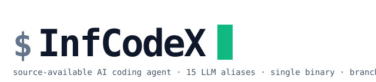
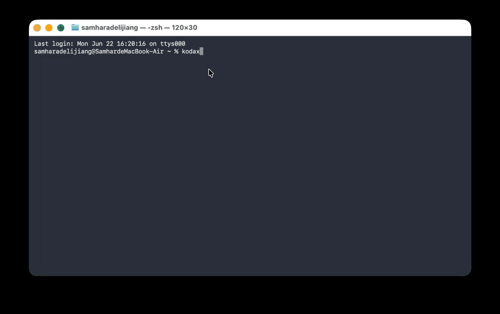

<p align="center">
  <picture>
    <source media="(prefers-color-scheme: dark)" srcset="assets/logo-dark.svg">
    <source media="(prefers-color-scheme: light)" srcset="assets/logo-light.svg">
    
  </picture>
</p>

<p align="center">
  <b>源代码可用的 AI Coding Agent，跑你能拿到的任何 LLM。</b><br>
  Anthropic · OpenAI · DeepSeek · Kimi · 智谱 · MiniMax · 小米 MiMo · 火山方舟 · Qwen · Gemini · Codex<br>
  REPL · CLI · 库 · 免 Node 单文件二进制
</p>

<p align="center">
  <a href="https://www.npmjs.com/package/@kodax-ai/kodax"></a>
  <a href="LICENSE"></a>
  <a href="https://github.com/icetomoyo/KodaX/stargazers"></a>
  <a href="https://github.com/icetomoyo/KodaX/actions"></a>
  
</p>

<p align="center">
  <a href="#30-秒上手">安装</a> ·
  <a href="#四种使用形态">使用形态</a> ·
  <a href="#为什么用-kodax">为什么用</a> ·
  <a href="CHANGELOG.md">更新日志</a> ·
  <a href="docs/FEATURE_LIST.md">Roadmap</a> ·
  <a href="https://github.com/icetomoyo/KodaX/discussions">讨论</a> ·
  <a href="README.md">English README</a>
</p>

<p align="center">
  
</p>

---

## 30 秒上手

```bash
npm i -g @kodax-ai/kodax

# 选一个你有 API key 的 provider
export ZHIPU_API_KEY=...        # 或 KIMI_API_KEY / MINIMAX_API_KEY / MIMO_API_KEY /
                                # ARK_API_KEY / DEEPSEEK_API_KEY / ANTHROPIC_API_KEY /
                                # OPENAI_API_KEY / QWEN_API_KEY / QWEN_TOKEN_API_KEY / GEMINI_API_KEY

kodax
```

就这样。进 REPL，自然语言提问。如果新机器既没有选择 provider，也没有任何
受支持的 API Key 环境变量，直接运行 `kodax` 会先打开只配置元数据的向导；它不会
要求输入或保存 Key。选择 provider/model 后，按提示设置对应环境变量、重启终端，
再运行 `kodax`。需要主动重新配置时可运行 `kodax setup`。

> **不装 Node 的目标机器**：从 [GitHub Releases](https://github.com/icetomoyo/KodaX/releases) 拿 Bun 编译的单文件二进制（Win / macOS / Linux × x64 + arm64）。详见 [docs/release.md](docs/release.md)。

---

## 四种使用形态

| 形态 | 命令 / 入口 | 什么时候用 |
|---|---|---|
| **REPL** | `kodax` | 交互式多轮编码会话，流式 UI + 权限 + slash 命令 |
| **CLI** | `kodax -p "your task"` | 单次脚本任务、CI、批量处理 |
| **库** | `import { runKodaX } from '@kodax-ai/kodax'` | 嵌入你自己的工具 / agent / 服务 |
| **单文件二进制** | `./kodax` | 分发到没装 Node 的机器 |

---

## Runtime SDK 与共享 daemon

`@kodax-ai/kodax/runtime` 支持 inline、Worker 和本机共享 daemon。FEATURE_269
让 CLI、Space、IDE 与其他本地 SDK 客户端可以原子加入同一个 Coder
session/run，共享 transcript、Todo、tool、AskUser、permission、队列与唯一终态。
daemon mutation 使用持久 operation identity 和 revision CAS；崩溃后不会盲目重放
可能已有副作用的 provider、run 或 Host Tool 调用。

Space 的 provider credential 仍由 OS keychain 持有，只通过 run/provider-scoped
broker 使用；Space Artifact/Office/Control 只通过显式绑定到该 run 的 Host Tool
lease 暴露。CLI run 不会因为 Space 后来加入而继承这些能力。Partner 继续使用独立
data/session root 下的 inline Runtime，不参与 Coder owner fence。capability 缺失时必须
fail closed，不能静默退回 inline Coder。完整接入说明见
[SDK Embedder Guide §23](docs/SDK_EMBEDDER_GUIDE.md#23-shared-coder-daemon-for-space-and-ide-hosts-feature_269-v0769)。

**v0.7.71 Electron 打包修复**：packaged/asar Electron 宿主可以直接自动启动
daemon，不会再次打开 GUI。`ELECTRON_RUN_AS_NODE` 只存在于子进程启动边界，
在 daemon 与普通用户子进程代码加载前即被移除。该路径要求 Electron 默认开启的
`RunAsNode` fuse；主动关闭该 fuse 的宿主必须通过普通 Node/KodaX CLI 启动 daemon，
再使用 attach-only 模式连接。SDK 的 `homeDir` 是拥有 `.kodax` 的 CLI 风格基础目录，
不是 `.kodax` 目录本身。

**v0.7.72–v0.7.73 Runtime 权限契约：**Auto Mode 的权限决策由 Runtime Session 持有，
不再由 UI hook 抢先决定。Runtime 会跨 turn 复用 LLM/rules guardrail，先分类、
仅在 `escalate` 时创建共享 permission 请求，并把自动降级到 rules 的结果持久化到
session。Session 也可设置 classifier model 和有界 timeout；`auto` 默认使用 LLM
分类，没有有效 classifier model 时会在调用 provider 或创建审批前返回可恢复配置错误，
绝不静默退回 rules。Runtime 权限请求可给出由 Runtime 生成的精确作用域建议：一次允许、
本 Session 允许，或（仅安全场景）持久允许；客户端只能回传不透明 suggestion id，不能从
预览内容自行扩大范围。持久授权由 daemon 持有并通过 revision 管理。没有宿主审批回调时，
不会向模型暴露 `exit_plan_mode`。完整 SDK 接入见
[Runtime Auto Mode 指引](docs/SDK_EMBEDDER_GUIDE.md#24-runtime-owned-auto-mode-and-plan-approval-bridges-v072)。

## 为什么用 KodaX

<table>
  <tr>
    <td width="33%" align="center" valign="top">
      <h3>🇨🇳 6 家国内 LLM 原生</h3>
      <sub>智谱 · Kimi · MiniMax · 小米 MiMo · 火山方舟 · 通义千问</sub>
      <br><br>
      first-class 适配器，跨 provider 在 5-alias canonical panel 做过 <a href="benchmark/EVAL_GUIDELINES.md">prompt-eval 校准</a> —— 不是 OpenAI-compat 转发。
    </td>
    <td width="33%" align="center" valign="top">
      <h3>📦 单文件二进制</h3>
      <sub>Bun --compile · Win / macOS / Linux · x64 + arm64</sub>
      <br><br>
      目标机器不装 Node。一份文件随处跑 —— 受管环境、内网、CI runner、断网机器都行。
    </td>
    <td width="33%" align="center" valign="top">
      <h3>🌳 可分叉会话血缘</h3>
      <sub>fork · rewind · 并行编辑</sub>
      <br><br>
      对话历史是 DAG 不是链表。即将发布的 <b>KodaX Space</b> 桌面端基于此。
    </td>
  </tr>
  <tr>
    <td align="center" valign="top">
      <h3>🤖 默认多 agent</h3>
      <sub>V2 Worker 单循环 + Sidecar Verifier + 异步子 agent</sub>
      <br><br>
      <code>spawn_agent</code>、<code>send_message</code>、<code>followup_task</code>、<code>interrupt_agent</code>，多实例自动协调（content-hash safety net）。
    </td>
    <td align="center" valign="top">
      <h3>🧩 Skills + 自构造</h3>
      <sub>Markdown skill，自然语言触发</sub>
      <br><br>
      5 阶自改造阶梯（scaffold → validate → stage → test → activate），由 8 条 admission invariant 守护。
    </td>
    <td align="center" valign="top">
      <h3>🛠 50+ 内置工具</h3>
      <sub>文件 · shell · 搜索 · MCP · ACP</sub>
      <br><br>
      repo intelligence、语义搜索、git worktree、web fetch，统一从干净的 tool definition 接口暴露。
    </td>
  </tr>
</table>

## 同类产品对比

| 能力 | **KodaX** | Claude Code | Aider | Codex CLI | Cursor | Cline |
|---|---|---|---|---|---|---|
| 源代码许可 | ⚠️ KAI-FCL，非商业 | ❌ source-available | ✅ Apache&nbsp;2.0 | ✅ Apache&nbsp;2.0 | ❌ 闭源 | ✅ Apache&nbsp;2.0 |
| 免 Node 单文件 | ✅ Bun | ❌ 需 Node | ❌ 需 Python | ✅ Rust | ❌ Electron | ❌ 插件 |
| 国内 6 家原生<br><sub>（智谱·Kimi·MiniMax·MiMo·方舟·Qwen）</sub> | ✅ 6 家原生 | ❌ | ⚠ 走 LiteLLM | ❌ OpenAI 主线 | ❌ 无 provider 菜单 | ⚠ Kimi/Qwen/DeepSeek |
| 可分叉会话血缘 | ✅ fork & rewind | ⚠ routines/sessions | ❌ | ❌ | ❌ | ⚠ checkpoints |
| Multi-agent + MCP + 50+ 工具 | ✅ 三项全有 | ✅ 三项全有 | ⚠ 有 tools, 无 MCP | ✅ 三项全有 | ⚠ Composer + MCP | ✅ 三项全有 |

<sub>数据于 2026-05 对照官方公开文档核对（[Claude Code](https://github.com/anthropics/claude-code) · [Aider](https://aider.chat/docs/llms.html) · [Codex CLI](https://github.com/openai/codex) · [Cursor](https://cursor.com) · [Cline](https://github.com/cline/cline)）。⚠ 表示部分支持 / 需额外配置 / 非 first-class。欢迎 PR 修正。</sub>

## 详细配置

> 上面的 `npm i -g @kodax-ai/kodax` 一行就够了。下面这一节是给"从源码构建 / 接自定义 provider / 把 KodaX 当库使用"的场景。

### 1. 从源码构建

```bash
git clone https://github.com/icetomoyo/KodaX.git
cd KodaX
npm install
npm run build
npm link
```

构建完成后就可以直接启动：

```bash
kodax
```

### 2. 配置模型提供商

可以先运行不会收集 Key 的交互配置：

```bash
kodax setup
```

命令会保存 provider/model，告诉你准确的环境变量名，然后退出以便重启终端。
也可以直接设置 API Key：

```bash
# macOS / Linux
export ZHIPU_API_KEY=your_api_key

# PowerShell
$env:ZHIPU_API_KEY="your_api_key"
```

Qwen Token Plan 需要选择 `qwen-token-plan` 并使用单独的凭据；`QWEN_API_KEY`
不能用于该路由：

```bash
export QWEN_TOKEN_API_KEY=your_api_key
kodax --provider qwen-token-plan
```

然后在 `~/.kodax/config.json` 里写一个最小配置：

```json
{
  "provider": "zhipu-coding",
  "effort": "auto"
}
```

### 3. 启动 REPL 或执行单次任务

```bash
# 进入交互式 REPL
kodax

# 单次任务
kodax "Review this repository and summarize the architecture"
```

进入 REPL 后，你可以直接自然语言提问，也可以使用命令：

```text
/help
/mode
/agent-mode ama
```

### 4. 作为库使用

```bash
npm install @kodax-ai/kodax
```

```typescript
import { runKodaX } from '@kodax-ai/kodax';

const result = await runKodaX(
  {
    provider: 'zhipu-coding',
    effort: 'auto',
  },
  'Explain this codebase'
);
```

#### SDK Subpath 导入（v0.7.39+）

如果只想用某个子能力，按 subpath 引入更轻量，bundler 也能更好地 tree-shake：

```typescript
import { Runner } from '@kodax-ai/kodax/agent';                // Agent runtime
import { getProvider } from '@kodax-ai/kodax/llm';              // LLM 抽象（16 个内置 alias）
import { runKodaX } from '@kodax-ai/kodax/coding';              // Coding tools + prompts
import { createImageArtifactFromPath } from '@kodax-ai/kodax/media'; // 输入 artifact helpers
import { SkillRegistry } from '@kodax-ai/kodax/skills';         // 零依赖 skill loader
import { loadConfig } from '@kodax-ai/kodax/repl';              // REPL 配置 / session 工具
import { createMcpManager } from '@kodax-ai/kodax/mcp';         // MCP popout manager（v0.7.42 起）
import { listSessions } from '@kodax-ai/kodax/session';         // session 历史工具
import { createKodaXRuntime } from '@kodax-ai/kodax/runtime';   // embedded/Worker/daemon 宿主 API
import { createKodaXA2AServer } from '@kodax-ai/kodax/a2a';    // A2A 1.0 双向接入
import { createMemoryAgent } from '@kodax-ai/kodax/experimental-memory'; // opt-in 实验性记忆 SDK
```

12 个 SDK 入口（root + 11 subpath）通过 ESM 共享 chunk 复用底层代码 —— 只 import `/agent` 不会把 `/repl` 的 Ink + React 一起拉进来。

完整的宿主集成契约——包括 embedded/Worker/daemon 所有权、外部 Agent 注册与任务控制、session cursor 分页、workflow 模型分层和效率遥测——见 [SDK Embedder Integration Guide](docs/SDK_EMBEDDER_GUIDE.md)。

> **SDK 是 ESM-only**。在 CommonJS 上下文（Electron main 进程、传统 Webpack CJS bundle、`require()` 调用方）必须用 `await import('@kodax-ai/kodax/...')` 代替 `require()`。详见 [docs/SDK_EMBEDDER_GUIDE.md §5](docs/SDK_EMBEDDER_GUIDE.md#5-consuming-from-a-commonjs-context-electron-main-cjs-bundles)，含 Electron main 完整 recipe + 为什么大多数 subpath 物理上无法做 dual ESM/CJS bundle。

### 5. 自定义 Provider（OpenAI / Anthropic 兼容端点）

任何 OpenAI 或 Anthropic 协议兼容的 endpoint 都可以通过 `customProviders[]` 接入，CLI 模式写在 `~/.kodax/config.json` 里：

```json
{
  "provider": "my-openai-compatible",
  "customProviders": [
    {
      "name": "my-openai-compatible",
      "protocol": "openai",
      "baseUrl": "https://example.com/v1",
      "apiKeyEnv": "MY_LLM_API_KEY",
      "model": "my-model",
      "userAgentMode": "compat",
      "reasoning": {
        "efforts": ["off", "low", "medium", "high", "max"],
        "default": "high"
      }
    }
  ]
}
```

`userAgentMode` 默认 `"compat"`（发送 `KodaX` 而非上游 SDK 的 User-Agent）；如果你的网关要求原生 SDK header，再切到 `"sdk"`。

自定义 reasoning 模型优先使用 v0.7.57 的 `reasoning: { efforts, default }`；无 thinking 能力的模型使用 `"reasoning": "none"`。SDK 宿主的 effort 选择器应从 `reasoningProfile.supportedEfforts` / `defaultEffort` 动态生成，不要假定固定五档。

#### OpenAI 兼容推理模型

部分 OpenAI-compatible 推理模型要求多轮请求时回放上一轮 assistant 的 `reasoning_content`。DeepSeek V4 thinking mode 是已知必须开启的场景；内置 DeepSeek provider 已经默认开启，但自定义 provider 需要显式配置：

```json
{
  "customProviders": [
    {
      "name": "my-deepseek-v4",
      "protocol": "openai",
      "baseUrl": "https://example.com/v1",
      "apiKeyEnv": "MY_DEEPSEEK_API_KEY",
      "model": "deepseek-v4-flash",
      "reasoningPreset": "deepseek-v4-openai",
      "replayReasoningContent": true
    }
  ]
}
```

如果网关同时代理 DeepSeek 和 OpenAI proper，建议用 per-model override，避免把 `reasoning_content` 发给不接受该字段的模型：

```json
{
  "models": [
    { "id": "deepseek-v4-flash", "replayReasoningContent": true },
    { "id": "gpt-5", "replayReasoningContent": false }
  ]
}
```

Sidecar verifier 的结构化裁决请求会优先使用 provider 级 `tool_choice` 强制工具调用；如果某个兼容端点明确拒绝 `tool_choice` 参数，KodaX 会对该 verifier 请求自动重试一次“不强制但仍带 tools”的兼容模式，并保持 fail-open，不会阻塞主 Worker。

调试 Worker 结束后的 verifier 行为时可设置：

```bash
export KODAX_VERIFIER_LOG=1
export KODAX_VERIFIER_PROVIDER=anthropic
export KODAX_VERIFIER_MODEL=claude-haiku-4-5-20251001
```

`KODAX_VERIFIER_LOG=1` 等价于在 `~/.kodax/config.json` 写 `"verifierLog": true`，会显示 verifier gate、elapsedMs 和 trace；`KODAX_VERIFIER_PROVIDER` / `KODAX_VERIFIER_MODEL` 需要成对设置，用独立模型执行 verifier；`KODAX_VERIFIER_ALWAYS=1` 仅建议调试和回归测试时使用。

SDK / headless 宿主可以通过 `KodaXEvents.onSidecarMessage` 观察 Sidecar
Verifier 的 `revise` / `blocked` 可执行消息；JSONL 输出使用同形
`sidecar.message` 事件。`accept` 仍保持静默。

#### 给自定义 provider 开图片 / vision 输入（FEATURE_134 v0.7.40）

如果你的自定义 provider 后面的模型支持 vision，加 `capabilityProfile.multimodalSupport: "image-input"` 显式开启，KodaX 的 SA-path policy gate 就不会人为拦截多模态请求。内置 vision-capable alias（Anthropic、OpenAI、DeepSeek、Kimi、Qwen、Zhipu、MiniMax、MiMo、Ark，以及通过 CLI `@<path>` file-include 语法传图的 Gemini-CLI）已经默认开了这个 flag。Codex-CLI 和自定义 provider 在底层模型支持图片输入时需要手动 opt-in。

```json
{
  "customProviders": [
    {
      "name": "my-vision-provider",
      "protocol": "openai",
      "baseUrl": "https://example.com/v1",
      "apiKeyEnv": "MY_LLM_API_KEY",
      "model": "my-vision-model",
      "capabilityProfile": {
        "transport": "native-api",
        "conversationSemantics": "full-history",
        "mcpSupport": "none",
        "contextFidelity": "full",
        "toolCallingFidelity": "full",
        "sessionSupport": "full",
        "longRunningSupport": "full",
        "multimodalSupport": "image-input",
        "evidenceSupport": "full"
      }
    }
  ]
}
```

序列化层（Anthropic-compat 走 `packages/llm/src/providers/anthropic.ts:770`，OpenAI-compat 走 `openai.ts:904`）通过基类继承自动转发 image block。这个 flag 只控制 KodaX 自身是否预先拒绝多模态请求 —— 上游模型到底支不支持 vision 由 provider 自己决定。如果模型实际是 text-only，你会看到真实的上游 API 错误，而不是 KodaX 一侧的 `[Provider Policy] multimodal requests are unsupported` 预拦截。

库模式下用 `registerCustomProviders()` 显式注册：

```typescript
import { registerCustomProviders, runKodaX } from '@kodax-ai/kodax';

registerCustomProviders([
  {
    name: 'my-openai-compatible',
    protocol: 'openai',
    baseUrl: 'https://example.com/v1',
    apiKeyEnv: 'MY_LLM_API_KEY',
    model: 'my-model',
    userAgentMode: 'compat',
  },
]);

await runKodaX({ provider: 'my-openai-compatible' }, '解释这个仓库');
```

### 6. Runtime 与本机 daemon

交互 REPL、位置参数、slash-command 生成的任务和 `kodax -p` 现在都走统一的
`KodaXRuntime` 入口。默认使用最低延迟的进程内 `embedded`；单一 SDK 宿主需要
独立 V8 与硬销毁时，可选择 Worker-hosted embedded；需要后台持续运行、断线后
查询或多个本机客户端共享时，可切到 `daemon`：

```ts
import { createKodaXRuntime } from '@kodax-ai/kodax/runtime';

const isolated = await createKodaXRuntime({
  mode: 'embedded',
  isolation: 'worker',
  requirements: { hardDispose: true },
});
```

inline 形态由调用方私有且开销最低；Worker 形态仍然私有，但可硬销毁；
daemon 形态使用独立进程并允许多个客户端共享。`runtime.close()` 会关闭
私有 inline/Worker Runtime，但对 daemon 只断开当前客户端。矛盾的隔离参数
会直接报错，不会静默降级。Worker 是 V8 故障隔离边界，不是安全沙箱。

daemon 按设计会持续驻留。测试若自动启动 daemon，删除临时 home 前还必须执行
`kodax daemon stop --home <目录> --profile <名称>`（或发送已认证的
`runtime.shutdown`）。不要按进程名批量结束 Node；应先核验命令行和父进程归属。

```bash
kodax daemon start
kodax daemon stop --profile default
kodax --runtime-mode daemon
kodax -p "检查这个仓库" --runtime-mode daemon
```

持久设置写入 `~/.kodax/config.json`：

```json
{
  "runtimeMode": "daemon"
}
```

统一优先级是：显式 CLI/SDK 参数 > 环境变量 > `config.json` > 内置默认值。
`KODAX_RUNTIME_MODE=daemon` 适合临时覆盖。其他成对配置也遵循相同规则，例如
`provider` ↔ `KODAX_PROVIDER`、`effort` ↔ `KODAX_EFFORT`。JSON 保持 camelCase，
环境变量保持 `KODAX_UPPER_SNAKE_CASE`，两者按语义一一对应。

一个 daemon 可以承载多个 session。不同 session 可以并发运行；同一个 session
内部仍保持一次只运行一个任务，后续任务按队列执行。多个 `kodax` 进程可以连接
同一个 daemon，并分别打开或观察不同 session。

### 7. 打包成单文件二进制（无需 Node）

KodaX 可以用 `bun --compile` 打包成单可执行文件 + 一个 `builtin/` sidecar 目录，目标机器**不需要安装 Node.js 或任何运行时**。

支持目标：`win-x64`、`linux-x64`、`linux-arm64`、`darwin-x64`、`darwin-arm64`。Win7 / glibc < 2.27 的发行版 / 龙芯 LoongArch 暂不支持。

本地构建：

```bash
# 先在构建机器上装好 Bun（一次性）
npm i -g bun                  # 或 scoop / brew / curl，详见 docs/release.md

npm run build:binary          # 当前平台（最快）
npm run build:binary:all      # 一台机器出全部 5 个目标
node scripts/build-binary.mjs --target=linux-arm64   # 指定平台
```

产物在 `dist/binary/<target>/`：

```
dist/binary/linux-x64/
├── kodax                          # ~60 MB Bun 编译的二进制
├── builtin/                       # 内置 skills sidecar
├── provider-capabilities.json
├── semantic-worker.js             # Repo intelligence Worker
├── runtime-worker.js              # SDK Runtime Worker
└── constructed-handler-worker.js  # Constructed tool Worker
```

冒烟验证：`dist/binary/<host>/kodax --version`。

**自动发布**：推送 `v*` git tag 会触发 `.github/workflows/release.yml`，在原生 runner 上构建全部 5 个目标、跑冒烟测试，然后自动创建 GitHub Release 并上传 archives + SHA256SUMS。也可以从 Actions UI 用 `workflow_dispatch` 不打 tag 跑流水线测试。

详细的构建参数、archive 结构、`KODAX_BUNDLED` / `KODAX_VERSION` build-time defines、故障排查，参见 [docs/release.md](docs/release.md)。

## 内置 Provider 列表

| Provider | 环境变量 | Reasoning | 默认 Model |
|----------|----------|-----------|-----------|
| anthropic | `ANTHROPIC_API_KEY` | Native | claude-sonnet-4-6（可 `/model` 切换 `claude-opus-4-6` / `claude-haiku-4-5`） |
| openai | `OPENAI_API_KEY` | Native | gpt-5.3-codex（可 `/model` 切换 `gpt-5.4` / `gpt-5.3-codex-spark`） |
| kimi | `KIMI_API_KEY` | Native | kimi-k2.7-code（262,144 token；可 `/model` 切换 `kimi-k2.7-code-highspeed` / `kimi-k2.6` / `kimi-k2.5`） |
| kimi-code | `KIMI_CODE_API_KEY` | Native | kimi-for-coding（可 `/model` 切换 `k3-256k`〔Moderato，256K〕/ `k3`〔Allegretto+，1M〕/ `kimi-for-coding-highspeed`；两个 K3 选项均请求上游 `k3`） |
| qwen | `QWEN_API_KEY` | Native | qwen3.5-plus |
| qwen-token-plan | `QWEN_TOKEN_API_KEY` | Native | qwen3.8-max-preview（Anthropic 协议；可 `/model` 切换 `qwen3.7-max` / `qwen3.7-plus` / `qwen3.6-flash` / `glm-5.2` / `deepseek-v4-pro`；均为 1M ctx；Qwen 3.8 / 3.7 Plus / 3.6 Flash 支持图片理解） |
| zhipu | `ZHIPU_API_KEY` | Native | glm-5（可 `/model` 切换 `glm-5.2` 1M ctx / `glm-5.1` / `glm-5-turbo`） |
| zhipu-coding | `ZHIPU_CODING_API_KEY` | Native | glm-5.2（1M ctx；仍可通过 `/model` 显式选择兼容模型 `glm-5.1` / `glm-5-turbo`） |
| zai-coding | `ZAI_CODING_API_KEY` | Native | glm-5.2（GLM Coding Plan 海外站，通过 `api.z.ai` 接入，Anthropic 协议 — 模型清单和 `zhipu-coding` 完全一致） |
| minimax-coding | `MINIMAX_CODING_API_KEY` | Native | MiniMax-M3（Frontier Coding，原生多模态 + 1M ctx；仍可通过 `/model` 显式选择兼容模型 `MiniMax-M2.7` / `MiniMax-M2.7-highspeed`） |
| mimo | `MIMO_API_KEY` | Native | mimo-v2.5-pro（小米 MiMo 按量计费，Anthropic 协议） |
| mimo-coding | `MIMO_CODING_API_KEY` | Native | mimo-v2.5-pro（小米 MiMo Token Plan，Anthropic 协议） |
| ark-coding | `ARK_CODING_API_KEY` | Native | glm-5.2（火山方舟 Coding Plan — GLM-5.2（别名 `glm-latest`） · Kimi K2.7 Code / K2.6 · MiniMax M3 / M2.7 · DeepSeek V4 Pro / V4 Flash · Doubao Seed 2.0 Code / Pro / Lite · Doubao Seed Code） |
| deepseek | `DEEPSEEK_API_KEY` | Native | deepseek-v4-flash（可 `/model` 切换 `deepseek-v4-pro`） |
| gemini-cli | `GEMINI_API_KEY` | Prompt-only / CLI bridge | （通过 gemini CLI） |
| codex-cli | `OPENAI_API_KEY` | Prompt-only / CLI bridge | （通过 codex CLI） |

> 不在表里的端点：用上面"自定义 Provider"那一节加进来即可。

## 内置工具一览

KodaX 有 50+ 个内置工具，按类别分组如下（实际暴露给 LLM 是一张扁平表）。

**文件操作**

| 工具 | 说明 |
|------|------|
| `read` | 读取文件（支持 offset / limit） |
| `write` | 创建新文件或完整重写 |
| `edit` | 精确字符串替换（支持 `replace_all`） |
| `multi_edit` | 对同一文件做一批独立 edit，整批原子提交 |
| `insert_after_anchor` | 在唯一 anchor 后插入内容，避免整文件重写 |
| `undo` | 撤销最近一次文件修改 |

**Shell 与搜索**

| 工具 | 说明 |
|------|------|
| `bash` | 执行 shell 命令（支持后台、输出截断） |
| `glob` / `grep` | 文件名匹配 / 正则内容搜索 |
| `code_search` | 代码搜索，比裸 grep 噪音更低 |
| `semantic_lookup` | 借助 repo intelligence 的符号 / 模块 / 流程感知查找 |
| `web_search` / `web_fetch` | 联网搜索 / 抓取，自带 trust + 时效信号 |

**Repo Intelligence working tools**

| 工具 | 说明 |
|------|------|
| `repo_overview` | 仓库结构、关键区域、入口提示、intelligence 快照 |
| `changed_scope` | 当前 diff 涉及的文件 / 区域 / 类别 |
| `changed_diff` / `changed_diff_bundle` | 单文件 / 多文件分页 diff |
| `module_context` | 模块 capsule（依赖、入口、符号、测试、文档） |
| `symbol_context` | 定义 + 可能的 caller/callee + 备选 |
| `process_context` | 入口的近似静态执行/流程 capsule |
| `impact_estimate` | 符号 / 路径 / 模块的影响面估算 |

**MCP 能力**（配置了 MCP server 时可用）

| 工具 | 说明 |
|------|------|
| `mcp_search` / `mcp_describe` / `mcp_call` | 通过共享 capability runtime 发现并调用 MCP 工具 |
| `mcp_read_resource` / `mcp_get_prompt` | 读取 MCP 资源、获取 MCP prompt |

**Git Worktree**

| 工具 | 说明 |
|------|------|
| `worktree_create` | 在隔离分支上新建 worktree，让 agent 安全工作 |
| `worktree_remove` | 移除 worktree（自带安全检查） |

**Agent 控制 / 交互**

| 工具 | 说明 |
|------|------|
| `spawn_agent` | 创建命名子 Actor，并在继承权限、会话并发和根工作预算约束下启动首个 Turn。 |
| `send_message` | 向 Actor 的持久 mailbox 提交有界信息，不启动新 Turn。 |
| `followup_task` | 在安全边界加入运行中的 Actor，或为 idle Actor 原子启动新 Turn。 |
| `wait_agent` | 等待一个或多个 Actor 状态变化，不轮询第二套任务注册表。 |
| `interrupt_agent` | 请求中断 active Turn，同时保留 Actor 身份。 |
| `list_agents` | 查看调用方有权访问的 Actor 子树与 Turn 状态。 |
| `agent_output` | 读取有权限的 Actor/Turn 有界持久输出。 |
| `ask_user_question` | 向用户发起单选 / 多选 / 自由文本提问 |
| `exit_plan_mode` | 仅在当前 REPL/宿主提供审批回调时提交最终方案 |
| `emit_managed_protocol` | managed-task 协议侧信道（verdict role payload）。v0.7.42 FEATURE_184 起默认走 V2 Worker 单循环 + Sidecar Verifier；v0.7.43 FEATURE_193 退役 V1 chain。 |

## Repo Intelligence（内置 full/light 引擎）

KodaX 内置 repo intelligence（`repo_overview` / `module_context` / `symbol_context` / `process_context` / `impact_estimate` 等），让 coding agent 不靠零散 grep/glob 就能理解大型仓库。

REPL 中使用 `/repo-intel status` 查看当前引擎状态。旧的独立 `repointel` host skill 已移除；repo intelligence 已内置于 KodaX，无需任何外部安装。

```bash
# 选一个运行模式（auto | full | light | off）
kodax --repo-intelligence full --repo-intelligence-trace
```

## 仓库结构

KodaX 是基于 npm workspaces 的 TypeScript monorepo，**源码层 4 个 workspace 包**（FEATURE_194 v0.7.43 包合并 — 9 → 4，ADR-036），npm 上以单 bundle 包 `@kodax-ai/kodax` 发布 + 11 个 SDK subpath exports（`/agent`、`/llm`、`/coding`、`/media`、`/repl`、`/skills`、`/mcp`、`/session`、`/runtime`、`/a2a`、`/experimental-memory`；ADR-024 + ADR-032 + ADR-038）。核心包：

| Workspace 包 | 作用 | 主要依赖 |
|----|------|---------|
| `@kodax-ai/llm` | LLM 抽象层（16 个内置 provider alias + 自定义 provider 注册），可独立使用 | `@anthropic-ai/sdk`, `openai` |
| `@kodax-ai/agent` | 通用 Agent 框架 —— Runner / runFanOut / runWithIdleYield / AgentActorController / AgentTurnScheduler + media/input artifacts + 会话管理 + tokenization + 面向自定义 loop 的可插拔 compaction primitive（不关闭 KodaX coding runtime 的始终开启策略）+ **inline 后**:session-lineage 子树 + capabilities (mcp + skills + builtin) + tracing（subpaths: `/media`、`/session-lineage`、`/capabilities/mcp`、`/capabilities/skills`、`/tracing`） | `@kodax-ai/llm`, `js-tiktoken`, `fflate`, `jimp`, `yaml` |
| `@kodax-ai/coding` | Coding Agent:50+ 工具（含 canonical Actor 协作工具）、role prompts、agent loop、auto-continue + repo-intelligence protocol(v0.7.43 inline) | `@kodax-ai/llm`, `@kodax-ai/agent` |
| `@kodax-ai/repl` | 完整交互式终端 UI（Ink / React、权限模式、命令系统、流式渲染） | `@kodax-ai/coding`, `ink`, `react` |

根目录 `src/kodax_cli.ts` 是 CLI 入口；`src/sdk-{agent,llm,coding,media,repl,skills,mcp,session,runtime,a2a,experimental-memory}.ts` 是 SDK subpath 入口；构建产物在 `dist/`，单文件二进制在 `dist/binary/<target>/`。

### 源码层 vs npm 发布层

KodaX 有两层结构，SDK 用户需要分开理解：

- **源码层**：上面 4 个 workspace 包（开发者读代码时看到的物理结构）。
- **npm 发布层**：单个 bundled 包 `@kodax-ai/kodax`，对外暴露 11 个 SDK subpath（SDK 消费者 `import` 时看到的接口）。subpath 分两种角色：
  - **完整包 subpath**（`/agent`、`/llm`、`/coding`、`/repl`）—— 每个 1:1 对应一个源码包，暴露完整公开 API。
  - **窄子集 subpath**（`/media`、`/skills`、`/mcp`、`/session`、`/experimental-memory`）—— 从 `/agent` 或 `/repl` 切出聚焦能力；`/experimental-memory` 明确为 opt-in 不稳定接口。

| 源码包 | npm subpath | 类型 | 内容 | 典型消费者 |
|---|---|---|---|---|
| `packages/llm`    | `@kodax-ai/kodax/llm`     | 完整包 | 15-alias LLM 抽象 (108 exports) | 独立 LLM 客户端 |
| `packages/agent`  | `@kodax-ai/kodax/agent`   | 完整包 | Runner / fan-out / 外部 Agent plane / session-lineage / capabilities / tracing (331 exports) | 自定义 agent 框架 |
| `packages/agent`  | `@kodax-ai/kodax/skills`  | **窄子集** | 仅 Skills 系统 —— `SkillRegistry` / `loadFullSkill` / `expandSkillForLLM` 等 (26 exports = v0.7.43 之前 `@kodax-ai/skills` 完整 API) | Skill 加载器、IDE 插件 |
| `packages/agent`  | `@kodax-ai/kodax/mcp`     | **窄子集** | 仅 MCP —— `McpCapabilityProvider` / `createMcpTransport` / `searchMcpCatalog` 等 (23 exports) | MCP server 宿主 |
| `packages/agent`  | `@kodax-ai/kodax/media`   | **窄子集** | 结构化图片/文件/视频输入 artifact helpers (22 exports) | 桌面宿主、多模态客户端 |
| `packages/agent`  | `@kodax-ai/kodax/experimental-memory` | **实验性子集** | F228-backed `MemoryAgent` / `MemorySession` scope、recall、query、observation、outcome 契约 | 显式评估 FEATURE_260 的 SDK 宿主 |
| `packages/coding` | `@kodax-ai/kodax/coding`  | 完整包 | Coding agent + 50+ 工具 + repo-intelligence (505 exports) | 构建 Claude Code 形态产品 |
| `packages/repl`   | `@kodax-ai/kodax/repl`    | 完整包 | Ink TUI + 权限模式 + 命令系统 (217 exports) | 终端 UI 消费者 |
| `packages/repl`   | `@kodax-ai/kodax/session` | **窄子集** | 仅会话管理 —— `listSessions` / `loadFullTranscript` / `appendClientNotice` / `forkSession` / `compactSession` / `watchSessions` 等 (17 exports) | 读取 session 历史的 IDE 插件和桌面宿主 |
| `src`             | `@kodax-ai/kodax/runtime` | 宿主 API | Embedded/Worker/daemon facade，含 sessions/runs/events/permissions/catalog/MCP/artifacts/diagnostics/外部 Agent 和 daemon schema (10 exports) | SDK 宿主、Space/IDE、daemon client |
| `src`             | `@kodax-ai/kodax/a2a` | 集成边界 | A2A 1.0 Agent Card 发现、JSON-RPC/SSE F258 executor、安全 fetch 与鉴权 Runtime Agent server | Agent 编排器和 KodaX 宿主 |

**经验法则**：需要 Runner / Agent / fan-out 时从 `/agent` 引入；只需要 skills 或 mcp API 时从 `/skills` 或 `/mcp` 引入，bundle 更小。窄子集是完整包的真子集 —— **不会**有额外符号。

**Workflow process surface（FEATURE_229，v0.7.50）**：动态工作流不再只是 REPL 私有文本，而是 Agent 层可复用的 process/event/snapshot 契约。SDK 宿主可以订阅 `WorkflowProcessEvent`、轮询 `WorkflowProcessSnapshot`，并通过 `createWorkflowRunManager` / `createWorkflowLifecycleController` 做 stop/pause/resume、读取 final result/artifact、删除/清理 terminal runs、管理 workflow identity/preflight。`/coding` 负责 coding workflow backend 与 run graph，`/repl` 只是消费同一份 snapshot 渲染 UI；SDK 不需要解析 slash-command 输出或 Ink view-model。`KodaXEvents` 回调新增可选 meta 尾参（`KodaXToolEventMeta` / `KodaXActivityEventMeta` / `KodaXWorkflowEventMeta`），宿主据此把每个子 Agent 的 tool/thinking/progress 事件归因到对应 workflow run 与 child id，无需第二套事件协议；生成/保存的工作流脚本在运行前过 `validateRestrictedWorkflowSource`（编译 + 源策略检查）与 generator 的 repair/smoke 循环。分层取舍见 [docs/ADR.md ADR-040](docs/ADR.md)。

**宿主读持久化历史（FEATURE_230 + FEATURE_234，v0.7.51；v0.7.63 hardening）**：面向「宿主读持久化状态」的 additive 闭环。**持久化工具记录回放**——resume 的会话现在会回放助手用过的工具卡片，而不是退化成纯文本。`messages` / `lineage` 仍是 canonical；`SessionData.uiHistory` 成为有界、脱敏、仅 terminal 状态的回放缓存。SDK transcript 契约明确化：`loadSession()` = 活动 model context，`loadFullTranscript()` = 带结构化条目的追加序 host scrollback（`message` / `compaction` / `branch_summary` / `rewind_marker` / `client_notice` / `task_result`）并带 clone provenance（`logicalId` / `sourceEntryId`），`uiHistory` = 可选回放缓存，工具卡片始终可从 canonical messages 重建。宿主可用 `appendClientNotice()` 持久化本地 slash 输出且不进入模型上下文；workflow/child 完成结果通过结构化 `taskResults[]` 暴露，不再要求解析 `<task-completed>` 文本。`rewind_marker` 只用于 host scrollback 审计，不进入 model-context messages。**Workflow run 宿主归属**——`WorkflowProcessTrackerOptions` / `WorkflowProcessSnapshot` 新增 host-owned 不透明 `hostMetadata?: Record<string, string>`，SDK 存储、持久化进 `run.json`、回读回显（含进程重启后）但不解释其含义，让宿主零侧表把 run 归回发起它的 session/surface。未 stamp 的旧 run 诚实回显 `hostMetadata === undefined`。详见 [docs/features/v0.7.51.md](docs/features/v0.7.51.md)。

**会话恢复与 ACP 污染修复（FEATURE_261，v0.7.67）**：直接运行 `kodax -r` 会进入可搜索、上下选择、Tab 补全和翻页的交互式会话选择器，并显示当前选中项的完整 session ID；`kodax -r <值>` 优先按完整 ID 恢复，ID 不存在时再按忽略大小写的完整标题匹配。标题唯一则直接恢复，同名标题则进入只包含候选项的选择器，绝不静默选第一条。`listSessions()` / Runtime / daemon 会话列表新增 `surface` 精确过滤和不透明 `cursor` 分页。ACP session 改为收到首个有效 prompt 后才持久化，ACP 测试强制使用临时 runtime home，避免测试记录写入真实 `~/.kodax/sessions`。`kodax -s cleanup-acp` 只预览严格匹配的空 ACP 污染记录；仅显式追加 `--apply-session-cleanup` 时才归档，不做永久删除。

**实验性 Memory Agent SDK（FEATURE_260，v0.7.68）**：`/experimental-memory` 暴露基于既有 F228 治理平面的薄 `MemoryAgent` 与 scoped `MemorySession`。被动 recall 零等待，`query()` 只读且由主 Action LLM 主动选择；持久化仍必须经过 proposal/preview/fingerprint/apply。召回内容保持低权限，安全与 scope 边界仍由确定性代码门禁承担。直接 session 示例与宿主边界见 [SDK Embedder Guide §21](docs/SDK_EMBEDDER_GUIDE.md#21-experimental-governed-memory--experimental-memory-feature_260-v0768)。

**双向 A2A 1.0（FEATURE_267，v0.7.69）**：`/a2a` 可发现 allowlist 内的 Agent Card，并通过既有 F258 plane 安装 JSON-RPC/SSE executor。配置中的出站 Agent 还会作为 `external:<name>` 自动注册到 embedded CLI 与用户 daemon Runtime，因此主 Agent 无需宿主代码即可编排。一个 `a2a.json` 可保存多个出站注册，但最多只有一个入站 server；入站可发布 Runtime 默认 Agent，或发布一个经过验证的 `~/.kodax/agents/*.md` Agent。内置 listener 仅允许 loopback；公网部署必须由宿主用 TLS、鉴权和授权包住 `handle()`。不宣称支持 A2A 0.3、gRPC、HTTP+JSON、push notification，也不会自动把本地 Agent 暴露到网络。详见 [SDK Embedder Guide §22](docs/SDK_EMBEDDER_GUIDE.md#22-bidirectional-a2a-10--a2a-feature_267-v0769)。

**A2A 互操作与认证加固**：发现得到的 interface 必须与受信 Agent Card 同源，且只有
完整满足 Card/Skill 的一个 security requirement 时才会携带凭据。无代码 client
支持 HTTP Bearer 兼容模式与 OAuth 2.0 Client Credentials；OAuth 的短期 access
token 由外部 Authorization Server 签发，KodaX 只在进程内缓存。入站 `a2a serve`
可以按外部 issuer/JWKS 校验 RFC 9068 JWT access token，但不会自行签发生产 token。
服务按 CLI、环境变量、配置、内置默认值的顺序解析 provider，Markdown Agent 也可
固定自己的 provider。补充输入会继续原 Runtime run；任务历史、保留策略与稳定
cursor 分页均有边界；带鉴权的 SSE 会先校验关联信息，流在正常终止但未给出终态时
回退 polling。仅远端直接 artifact、输出 broker 暂存结果，以及成功授权执行的 Skill
脚本输出可以发布；普通工作区写入与本地路径不会暴露。

这里的认证与逐 Agent 激活加固，是对 v0.7.69 F267/F268 设计的发布后补全，
随 v0.7.71 补丁交付；并不表示早期 v0.7.69 二进制已经包含后续 OAuth profile。

**v0.7.70 MCP 发现加固**：能力使用精确 ID 和带 revision 的 cursor，结果按真实物理
容量准入。紧凑 CJK 查询会分词；跨语言 lexical 零匹配只会返回容量内的无损分组
清单，或一条使用 catalog 语言的简短重试提示。部分 provider 失败会显式保留，
不会伪装成完整结果。

完整的内置调用路径不需要再写 TypeScript：

```bash
# 调用外部 A2A Agent
kodax a2a add research https://agent.example/.well-known/agent-card.json --effect read
kodax a2a test research
kodax a2a call research "总结这个主题"

# 先保存受 OAuth 保护的 Agent，再热启用/停用
export RESEARCH_A2A_CLIENT_SECRET='由你的授权服务器分配'
# PowerShell：$env:RESEARCH_A2A_CLIENT_SECRET='由你的授权服务器分配'
# PowerShell：将命令写成一行，或把每个行尾反斜杠替换为反引号。
kodax a2a add reviewer https://reviewer.example/.well-known/agent-card.json \
  --disabled --effect read --oauth-scheme enterprise-oauth \
  --oauth-issuer https://identity.example/ \
  --oauth-token-url https://identity.example/oauth/token \
  --oauth-client-id kodax-reviewer \
  --oauth-client-secret-env RESEARCH_A2A_CLIENT_SECRET \
  --oauth-scope a2a.invoke --oauth-resource https://reviewer.example/
kodax a2a enable reviewer
kodax a2a disable reviewer       # 只阻止新调度，不取消已运行任务

# 暴露 Runtime 默认 Agent，或指定 ~/.kodax/agents/*.md 中的 Agent 名称
export KODAX_A2A_TOKEN='请替换为足够长的随机令牌'
# PowerShell：$env:KODAX_A2A_TOKEN='请替换为足够长的随机令牌'
kodax a2a expose                 # 或：kodax a2a expose document-agent
kodax a2a serve                  # 仅监听 http://127.0.0.1:8765
```

MCP、A2A、Extension 分别使用 `~/.kodax/integrations/` 下的一个用户级文件。
可以通过 `kodax config template <mcp|a2a|extensions>` 查看模板，通过
`kodax integrations migrate --apply` 迁移旧配置，并用 `kodax mcp`、
`kodax a2a`、`kodax extensions` 管理。迁移只导入旧
`config.json#mcpServers` 与 `config.json#extensions`；A2A 没有旧来源，且不会
覆盖已有目标文件。第一次 MCP/Extension 修改可以暂存旧条目；只有在检查目标文件
和明文 secret 警告后，才应同时使用 `--apply --cleanup-legacy` 清理旧 key。
运行中的 CLI/daemon 保留最后一个
有效版本，完整替换 MCP provider、逐条协调 Extension，并热注册出站 A2A Agent。
每个 A2A 条目都有期望态 `enabled`；`kodax a2a list` 显示配置，实际已应用注册以
拥有该 Runtime 的进程为准。自动协调不会获取已停用条目的 Card 或 token；拥有者
观察并应用该 revision 后，停用条目才会阻止新调度，CLI 写入返回本身不是跨进程生效
确认。`a2a add --disabled` 默认仍会校验 Card，除非显式使用 `--no-test`；`a2a test`
只做 discovery/security planning，不会申请 OAuth token。示例中的固定
`KODAX_A2A_TOKEN` 是运维侧预先提供的兼容凭据，并非 KodaX 自行生成或签发。
停用条目可随时重新启用。
`a2a serve` 会在监听前装载已配置的 MCP/Extension 能力并固定执行权威，同时热加载
公开信息、鉴权和限额。Agent、Skill、Extension 工具权威、工作区、tool policy
或任务存储变更必须显式重启服务。

A2A 配置迁移与历史任务 owner 迁移是两件事。如果升级 realm-aware owner key
后仍需访问 v0.7.70 的任务库，应先停止 A2A server，执行
`kodax a2a migrate-tasks` 查看精确 owner 计划，再用
`--apply --confirm-server-stopped` 应用。OAuth 还必须提供已知历史
`--subject`；正常服务不会猜测或双读 legacy owner key。

托管 A2A 上下文默认位于 `~/kodax_a2a_server_workspace/<runtime-profile>/contexts/`。
精确授权的 Skill 脚本必须使用隔离策略，并通过 `kodax sandbox doctor`；
Windows 的一次性显式初始化由 `kodax sandbox setup` 完成。

**v0.7.72 会话恢复与队列闭环：**裸 `kodax -r` 先加载可搜索选择器，不为列出
session 预加载完整 CLI；选中后才把 stdin 交给恢复后的 REPL，Esc 会释放选择器的
stdin 并立即回到原 shell。历史回放保留每条持久 event 的原始时间。用户 follow-up
使用 session-root Actor queue scope，避免一个 session/child 的待处理输入被另一个
REPL 显示、唤醒或消费。

**外部 Agent SDK plane（FEATURE_258，v0.7.67）**：`/agent` 导出协议中立的 executor、registration、policy、credential broker、artifact policy、catalog 和 durable task 契约；`/runtime` 通过 `admin.agentRegistrations`、`agents`、`agentTasks` 向 embedded 与 daemon client 提供同一组 DTO API。Executor factory 是宿主函数，只能装入 inline owner，或在创建新的 in-process daemon owner 时装入；不能通过既有 daemon 连接或 Runtime Worker 边界注入。Plane 关闭后是终态：未完成的 wait 和后续所有服务调用都会拒绝；受限 Workflow 脚本会完整校验并传递 `phase` 与外部 `target`。完整所有权、注册、preflight、启动/等待/继续/取消/对账和安全边界见 [SDK Embedder Guide §18](docs/SDK_EMBEDDER_GUIDE.md#18-external-agent-executor-plane-feature_258-v0767)。

**成本受控 Workflow SDK（FEATURE_259，v0.7.67）**：SDK 调用方用 run-scoped `modelTiers` 与 `workflow.maxConcurrency` 配置路由和并发，workflow 作者只表达 `fast` / `balanced` / `deep` 语义意图。terminal workflow event 回显 tier/source/fallback/usage/duration，持久化 `run.json.efficiencyReport` 给出 token coverage、role/tier 启动数、packet-read 拓扑、review wave 和 quality gate 结果。完整配置与遥测读取方式见 [SDK Embedder Guide §20](docs/SDK_EMBEDDER_GUIDE.md#20-cost-disciplined-workflow-routing-and-telemetry-feature_259-v0767)。

**Inline workflow authoring（FEATURE_246，v0.7.58；F270 于 v0.7.72 更新）**：Worker 在明确表达 Workflow 意图时，可通过 model-callable 的 `run_workflow` 工具在会话内编写并运行工作流。F270 退役 AMAW 与复杂度驱动激活；AMA 保留显式 `/workflow`、named/SDK 和自然语言 Workflow 请求。Workflow 子 Agent 统一运行在 Actor 控制面。详见 [docs/features/v0.7.58.md](docs/features/v0.7.58.md)、[docs/features/v0.7.72.md](docs/features/v0.7.72.md) 与 ADR-044/046/047/048/049/055。

**历史工作流激活分层（FEATURE_248 + FEATURE_249，v0.7.59；F270 于 v0.7.72 取代）**：v0.7.59 引入 AMAW 和 AMA 的显式请求行为。F270 退役 AMAW 及其复杂度驱动指令；SA 保持单独作业，AMA 成为唯一自适应多 Agent 模式，并且只在明确 Workflow 意图下激活 Workflow。详见 [docs/features/v0.7.59.md](docs/features/v0.7.59.md) 与 [docs/features/v0.7.72.md](docs/features/v0.7.72.md)。

**managed 工具路径的渐进披露（FEATURE_250，v0.7.60；F270 模式更新于 v0.7.72）**：deferred-tool 渐进披露机制应用于 AMA 的 managed path。缓存冷启轮次以一行 search hint 替代 13 个 non-mcp 延迟工具的完整描述；F270 退役原 AMAW 模式，但不改变这项披露行为。详见 [docs/features/v0.7.60.md](docs/features/v0.7.60.md)。

**上下文高效的工具结果 + Workflow 质量预检（FEATURE_251 + FEATURE_252，v0.7.61；2026-07-14 纠偏）**：本地工具先完整采集，只采用契约等价且严格更短的无损规范化；命令专用 Bash 有损过滤默认关闭，compound Bash 不使用语义 adapter。并行结果由唯一 owner 按最终 provider 请求统一判容：先求满足 `Pmax + 输出预留 + max(2048, Pmax 的 3%) <= 上下文窗口` 的最大最终输入，再只使用剩余物理容量。能放下就逐字交付，只有真实溢出才持久化完整结果并返回 `KODAX_RESULT_INCOMPLETE`。历史仍遵守相同的物理容量安全规则：容量内不做默认有损 microcompaction，压力下 summary-first，无法形成可恢复请求时 typed failure，禁止静默删除。FEATURE_272 仅取代 FEATURE_251 的大型压缩默认触发策略；FEATURE_252 的确定性 workflow 启动前合约 lint 保持不变。详见 [docs/features/v0.7.61.md](docs/features/v0.7.61.md) 与 [docs/ADR.md ADR-050](docs/ADR.md)。

**可靠且始终开启的上下文压缩（FEATURE_272，v0.7.74）**：自动大型压缩不允许关闭。百分比阈值默认 75%，并限制在 15-90%；可选 `triggerTokens` 未设置或为 0 时不生效，否则百分比、绝对值和物理容量三者取最小。最近原始尾部保护量为有效阈值的 20%。一次事务压缩保护尾部之外的完整 eligible prefix，并用精确 query ledger 保留所有真实用户请求；只有实际减少 token、恢复物理可用且等待持久化提交成功后才发出成功事件。原始正文从内存驱逐前，根宿主会先持久化并刷盘精确 lineage；sidecar 与精简 Session 通过稳定 entry ID 合并去重。根 Agent 可用有界的 `session_history_search` → `session_history_read` 回溯被省略的用户、助手和工具细节，SDK/Runtime 则使用 revision-bound `transcriptSearch`、分页和无损 chunk；隐藏思考、system 指令与合成 checkpoint 不进入模型检索。详见 [功能设计](docs/features/v0.7.74.md)、[SDK 指南第 25 节](docs/SDK_EMBEDDER_GUIDE.md#25-always-on-context-compaction-and-bounded-transcript-recovery-v0774) 与 [ADR-057](docs/ADR.md#adr-057-large-compaction-is-an-always-on-context-scoped-full-coverage-transaction)。

```
KodaX/                       # 4 workspace packages(FEATURE_194 v0.7.43)
├── packages/
│   ├── llm/                 # @kodax-ai/llm —— 16 个内置 provider alias
│   ├── agent/               # @kodax-ai/agent —— Runner / fan-out / idle-yield + 子树:
│   │   ├── session-lineage/ # 分支 session tree (v0.7.43 inline)
│   │   ├── capabilities/
│   │   │   ├── mcp/         # MCP 集成 (v0.7.43 inline)
│   │   │   └── skills/      # Skills 标准实现 + builtin (v0.7.43 inline)
│   │   └── tracing/         # 追踪 / 可观测性 (v0.7.43 inline)
│   ├── coding/              # @kodax-ai/coding —— tools + prompts + agent loop
│   │   └── repo-intelligence/ # 含 protocol.ts (v0.7.43 inline)
│   └── repl/                # @kodax-ai/repl —— Ink TUI
├── src/
│   ├── kodax_cli.ts         # CLI 主入口（bin: `kodax`）
│   └── sdk-*.ts             # SDK subpath 入口 → @kodax-ai/kodax/{agent,llm,coding,media,repl,skills,mcp,session,runtime,a2a,experimental-memory}
├── scripts/
│   ├── build-bundle.mjs     # esbuild 单 bundle 多 entry 打包（CLI + root + 11 SDK subpath + chunks）
│   ├── build-binary.mjs     # Bun --compile 单文件二进制打包
│   └── release.mjs          # ADR-024 release-time pkg name/exports 注入
└── .github/workflows/
    └── release.yml          # 推 v* tag 自动发布 GitHub Release
```

这套拆分让你既可以把 KodaX 当成完整产品使用，也可以只复用其中某一层能力 —— SDK 消费者装 `@kodax-ai/kodax` 后从 subpath（`@kodax-ai/kodax/agent` 等）按需 import。
## API 导出

```typescript
// 主函数
export { runKodaX, KodaXClient };

// 类型
export type {
  KodaXEvents, KodaXOptions, KodaXResult,
  KodaXMessage, KodaXContentBlock,
  KodaXSessionStorage, KodaXToolDefinition
};

// 工具
export { KODAX_TOOLS, KODAX_TOOL_REQUIRED_PARAMS, executeTool };

// Provider
export { getProvider, KODAX_PROVIDERS, KodaXBaseProvider };

// 工具函数
export {
  estimateTokens,
  getGitRoot, getGitContext, getEnvContext, getProjectSnapshot,
  checkPromiseSignal
};
```

---

## 术语说明

| 术语 | 含义 | 位置 |
|------|------|------|
| **Skills** | Agent 能力（KODAX_TOOLS: read, write, bash 等）+ 扩展 Skills | Coding 层 + Skills 层 |
| **Commands** | CLI 快捷命令（/review, /test 等） | REPL 层 |

---

## 开发

```bash
# 开发模式
npm run dev "你的任务"

# 构建
npm run build

# 可选：只构建 workspace packages
npm run build:packages

# 打包成单文件二进制（当前平台 / 全平台）
npm run build:binary
npm run build:binary:all

# 测试
npm test

# Eval-driven development（provider 矩阵、identity round-trip 等）
npm run test:eval

# 清理
npm run clean
```

### Repo Intelligence 缓存目录

KodaX 现在会把 Repo Intelligence 的本地缓存分成内置引擎 profile：

- `.agent/repo-intelligence/`
  - full 引擎索引、缓存和现有 task-engine 产物。
- `.agent/repo-intelligence/light/`
  - light 模式启发式索引缓存。

这样拆开的目的很明确：

- full 和 light profile 可以独立重建。
- light 模式的低置信度状态不会被误认为 full 引擎状态。
- 未来缓存迁移可以删除一个 profile，而不破坏另一个。

`.agent/repo-intelligence/` 是本地生成目录，不应该提交到 Git。

---

## 文档

- [README.md](README.md) - 英文版 README
- [docs/SDK_EMBEDDER_GUIDE.md](docs/SDK_EMBEDDER_GUIDE.md) - SDK 宿主集成、shared Runtime、v0.7.73 Auto Mode 与精确授权契约
- [docs/release.md](docs/release.md) - 单文件二进制构建与发布流程
- [docs/PRD.md](docs/PRD.md) - 产品需求
- [docs/ADR.md](docs/ADR.md) - 架构决策
- [docs/HLD.md](docs/HLD.md) - 高层设计
- [docs/DD.md](docs/DD.md) - 详细设计
- [docs/FEATURE_LIST.md](docs/FEATURE_LIST.md) - Feature 跟踪
- [docs/test-guides/](docs/test-guides/) - 功能专用测试指南
- [CHANGELOG.md](CHANGELOG.md) - 更新日志（v0.7.0+；更早版本见 [CHANGELOG_ARCHIVE](docs/CHANGELOG_ARCHIVE.md)）


---

## 许可证

[KodaX-AI Fair Core License (KAI-FCL) 1.0](LICENSE) - Copyright 2026 icetomoyo。

KAI-FCL 是 source-available / fair-core 协议，不是 OSI open source。商业、
企业、托管部署、付费服务或客户再分发用途，需要 KodaX-AI 授权，并在需要时
具备有效 entitlement。

KodaX-AI 当前官方许可政策：KodaX 0.7.70 及之后版本，在由 KodaX-AI 带有该
notice 分发时，适用 KAI-FCL 或配套 KodaX-AI 客户条款。此前已带 Apache-2.0
notice 分发的历史 tag、source archive、二进制、npm 包或其他副本，仍只对那些
特定副本保留 Apache-2.0。

## 相关仓库

建议把公仓和私仓 clone 到同一个父目录下，例如：

- public repo: `<parent>/KodaX`
- private repo: `<parent>/KodaX-private`（未公开发布）
